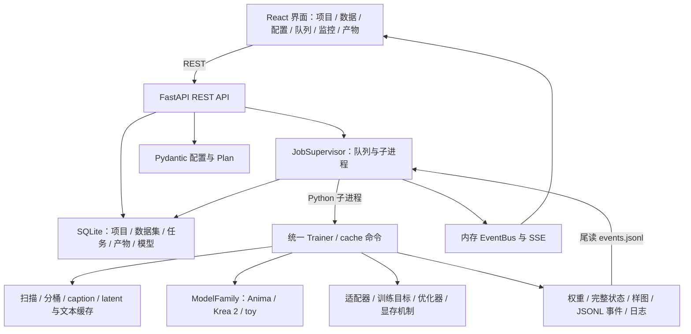

**YPuddin Train Studio 当前完成度审计 · 2026-09-11**

当前应定位为：**主体架构和多数功能已实现、CPU 基础链路可运行，但仍需训练正确性修复、平台适配和真实权重验收的 alpha 测试版。** 不能依据 HANDOVER 中的“全部完成”“唯一缺口是 GPU 验证”，把它认定为可以直接交付的训练器。

本次审阅以 `/Volumes/Service/Dev/YPuddinTrainStudio/xiangmuyuanma` 当前工作区为准，包含已有未提交修改。读取了 HANDOVER、设计/状态/前端/部署文档和前端交接文件，沿实际源码核查训练、配置、数据、适配器、模型、服务、界面及部署，并复跑现有测试、补做临时小规模复现。业务源码没有修改，现有修改没有重置或提交；新增本报告，测试和前端构建产生了常规生成文件。

`AnimaLoraStudio`、`sd-scripts`、`diffusion-pipe`、`LyCORIS` 是同级参考目录，当前应用运行不依赖这四个目录。模型定义中有已随项目保存的第三方代码，来源记录在两族的 `vendor/NOTICE.md`。本报告不重新背书旧文档对参考项目的所有优劣评价，也不以那些项目的能力计算本项目完成度。

当前版本为未发布的 `0.1.0`，HEAD 为 `a254283`，本地历史 62 个提交。工作区原已有 15 个受版本控制文件发生修改，另有新截图、MPS 前端测试和旧源码 zip 等未跟踪文件。审计时统计：后端及脚本 16,455 行，其中 vendor Python 4,940 行；后端测试 4,051 行；前端 TS/TSX/CSS 10,523 行。代码规模说明项目已有大量实现，功能完成度仍以实际调用和验收为准。

**实际架构已经连通。** 它是本地 Python 服务加浏览器界面的应用，训练逻辑没有调用外部参考仓库的训练脚本。

任务入队时保存配置，监督器启动独立子进程；Trainer 加载模型，建立数据和缓存，再注入适配器、构建优化器/采样器，进入训练。预览和验证在训练进程内执行。训练事件写 JSONL，监督器读取后更新任务状态并发 SSE；stdout/stderr 单独存日志。权重保存事件会注册产物供界面下载和转换。

关键入口：[CLI](/Volumes/Service/Dev/YPuddinTrainStudio/xiangmuyuanma/ypuddin/cli.py)、[任务创建](/Volumes/Service/Dev/YPuddinTrainStudio/xiangmuyuanma/ypuddin/server/routes_work.py:534)、[监督器](/Volumes/Service/Dev/YPuddinTrainStudio/xiangmuyuanma/ypuddin/server/supervisor.py:85)、[Trainer](/Volumes/Service/Dev/YPuddinTrainStudio/xiangmuyuanma/ypuddin/train/trainer.py:102)。真实包名是 `ypuddin/train`、`ypuddin/server`，不是 HANDOVER 中部分段落写的 `trainer/`、`service/`。

| 模块 | 已实现的内容 | 当前完成边界 |
|---|---|---|
| 配置与预检 | 分组 Pydantic、额外字段拒绝、JSON/TOML、覆盖项、预设、JSON Schema、show_when 解释器、步数/参数/显存估算 | 前端消费静态 schema；部分配置不生效；Plan 为启发式估算，未完整复用训练校验和验证集切分 |
| 数据流水线 | 内容哈希扫描、索引缓存、多比例桶、重复采样、caption 变换、正则集、mask、latent/文本缓存、验证集 | 编码器和 mask 的缓存失效策略有缺陷；source 分辨率覆盖与显式验证源有已复现错误 |
| 适配器 | LoRA、LoKr、LoHa、Full、DoRA；规则匹配、参数组学习率、热启动、保存/载入 | Full 是选定 Linear 的完整权重差分，并非整个模型所有参数微调；特殊配置恢复有错误 |
| 训练循环 | 梯度累积、裁剪、调度器、EMA、步/轮保存、暂停/恢复、验证、Euler+CFG 预览 | 默认 toy 恢复一致；分别启用 scalar 初始化或 module_dropout 时恢复不一致；初始采样、fused backward 等未接线 |
| Anima | Cosmos DiT、Qwen3、T5 token ids、LLM Adapter、Qwen-Image VAE，加载/前向/采样/导出 | 缩小架构 CPU 测试通过；官方权重、GPU 数值和实际训练效果未验收 |
| Krea 2 | SingleStreamDiT、Qwen3-VL 隐层堆叠、VAE、动态 shift、BF16/FP8-scaled 加载 | 同样只有缩小架构验证；只支持 cached text；unsloth 选项降级为 block 重算 |
| 显存机制 | FP8 存储层、Block Swap、激活重算、Anima 激活卸载、Kahan、编码器卸载 | CUDA 首步有设备风险；swap/量化介入晚，不能降低首次全模型加载峰值；显存收益未测 |
| 服务 | 项目/数据集/草稿/模型/产物 API；train/cache 队列；控制命令；SSE；日志/历史查询 | 本地单用户；按进程数调度，没有显存准入或 GPU 指派；异常/缓存阶段控制仍需收尾 |
| 前端 | 10 个页面，真实 REST，数据集虚拟网格与 tag 编辑，配置/Plan/入队，监控、产物下载/转换 | 主流程覆盖广，但表单类型、实时状态和几个按钮/图表控件未完成 |
| 工具与部署 | merge/extract/resize/convert/smoke，studio.sh/.bat，环境安装与前端构建 | LoRA smoke 有假失败；新机器安装与最终包未验收；现存 zip 是旧快照 |
| Apple Silicon | 前端平台识别、MPS 标签、空值显示、适配中提示 | 后端自动选择、统计、统一内存规划和 MPS 完整训练仍未闭环 |
| 多 GPU | 分桶采样器留有 world_size/rank 参数 | Trainer 没有 DDP 初始化、包装、rank 0 保存和任务设备分配 |

模型族具体组合与任务责任已有清楚边界：模型族负责加载、文本/图像编码、前向、目标层和显存布局；Trainer 统一处理训练。Anima 的可训练 LLM Adapter 是 DiT 内部模块，**不代表 Qwen 文本编码器可训练**；两族 Qwen 编码器当前均冻结。预览采样器只有 Euler，模型范围也只有 Anima、Krea 2 与测试用 toy，不能因目录里有 sd-scripts 就认为支持 SD/SDXL/FLUX 等模型。

本次验证结果如下。初次后端执行处于受限沙盒，不能绑定回环端口；端口限制解除后，真实服务测试完成重跑。

| 验证 | 实测结果与解释 |
|---|---|
| `venv/bin/python -m pytest tests/ -q` | 当前沙盒收集 210 项，206 项通过，4 项服务夹具报 socket bind `EPERM`；没有据此判为产品故障 |
| `venv/bin/python -m pytest tests/e2e/test_service.py -q -o addopts=` | 在允许本机端口的环境重跑，5 项通过，11.29 秒；其中包括上述 4 项和该文件内另一项 |
| `npm run lint` | 通过，0 warnings |
| `npm run test` | 55 项、10 个文件通过 |
| `npm run build` | TypeScript/Vite 通过，无警告；ECharts 单独分块 546.88 kB |
| 额外恢复复现 | 默认配置连续/恢复结果相同；开启 scalar 或 module_dropout 后结果不同 |
| 额外数据复现 | source 分辨率覆盖报 KeyError；显式验证源误用训练源配置；启用/改 mask 复用旧缓存 |
| 额外工具复现 | at_start 没产生初始样图；LoRA smoke 训练与采样成功却报告模块数不符 |
| 官方模型/GPU/ComfyUI/新机器安装 | 本次未验证，不能引用历史截图或 CPU 测试作为替代 |
| npm audit | 本次没有运行，HANDOVER 的 0 漏洞只是旧记录 |

当前测试环境为 macOS 15.7.9 arm64、Python 3.12.12、torch 2.14.0、transformers 5.17.0；受限进程检测结果为 CUDA 不可用、MPS 已编译但不可用。这个 MPS 探测结果仅描述本次执行环境，不代表这台 Apple Silicon 硬件不支持 MPS。本次没有跑官方权重。

Anima/Krea2 E2E 的确使用真实模型代码，但测试缩小了层数/宽度，使用合成权重、64px 图像，并把 VAE 加载器替换为微型真实架构。测试验证结构兼容和代码路径，不验证大模型加载峰值、真实生成质量或训练收敛。前端测试主要覆盖工具函数、MSW 数据和首屏渲染，任务详情测试 mock 了 EChart，未测试图表控件的实际效果。

下面是接手时应优先处理的具体问题。标注“复现”表示本次执行得到结果；“源码”表示调用链明确，但相关真实硬件或用户界面分支没有现场执行。

1. **CUDA 首步噪声生成的设备不匹配（源码，优先级最高）。** Trainer 建立 CPU `torch.Generator()`，Objective 却用它在 `x0.device` 创建噪声。CUDA 训练时这两个设备不一致；输入扰动噪声也有同样路径。本机 torch 的 `Generator.h` 明确检查生成器与后端设备类型一致。应在 GPU 验收前处理这个明显阻断风险；本次没有 CUDA 现场 traceback。

   证据：[生成器创建](/Volumes/Service/Dev/YPuddinTrainStudio/xiangmuyuanma/ypuddin/train/trainer.py:75)、[噪声创建](/Volumes/Service/Dev/YPuddinTrainStudio/xiangmuyuanma/ypuddin/objectives/flow.py:197)。同项目预览采样已采用 CPU 生成后搬设备的方式，可参考 [euler.py](/Volumes/Service/Dev/YPuddinTrainStudio/xiangmuyuanma/ypuddin/sampling/euler.py:40)。

2. **“任意配置精确恢复”不成立（复现）。** 默认 toy 连续训练与从 state-2 续训到 12 步一致，但启用 `init="scalar"` 或 `module_dropout=0.2` 后不一致。根审计读取两组最终保存文件，最大绝对偏差分别为 0.0068359375 与 0.0048828125，默认对照为 0。

   scalar 的根因是完整检查点保存了面向推理的导出张量，scalar 已折入矩阵，恢复时没有还原训练参数本身；dropout 路径则受全局 RNG 和恢复后 DataLoader iterator 创建影响。另一个边界是 dataset fingerprint 不含 caption/mask 内容：只修改 caption 后指纹不变，恢复时不会对此提出数据变更警告。

   证据：[保存状态](/Volumes/Service/Dev/YPuddinTrainStudio/xiangmuyuanma/ypuddin/train/trainer.py:384)、[导出约定](/Volumes/Service/Dev/YPuddinTrainStudio/xiangmuyuanma/ypuddin/adapters/base.py:84)、[恢复加载](/Volumes/Service/Dev/YPuddinTrainStudio/xiangmuyuanma/ypuddin/adapters/inject.py:125)、[module dropout](/Volumes/Service/Dev/YPuddinTrainStudio/xiangmuyuanma/ypuddin/adapters/linear.py:77)、[数据指纹](/Volumes/Service/Dev/YPuddinTrainStudio/xiangmuyuanma/ypuddin/data/index.py:162)。临时复现产物在 `/private/tmp/ypuddin-audit-resume-21eb5m_k`。

3. **缓存可能静默复用错误数据（mask 已复现，编码器指纹由源码确认）。** latent 缓存中同时保存 mask，键却不含 mask 内容和 masked_loss 状态。先以无 mask 配置缓存，再启用 mask，编码写入数为 0，训练 sample 中仍没有 mask。把已缓存的全白 mask 改为全黑，读出的均值仍为 1.0，应为 0.0。

   两族 VAE 的 fingerprint 还是相同的固定字符串，Anima 文本也是固定类型标识，Krea2 文本只追加选层信息。它们没有标识实际编码器权重和 tokenizer；同一项目换编码器时，不能保证缓存自动失效。

   证据：[缓存键和读取](/Volumes/Service/Dev/YPuddinTrainStudio/xiangmuyuanma/ypuddin/data/dataset.py:168)、[mask 与 latent 一起保存](/Volumes/Service/Dev/YPuddinTrainStudio/xiangmuyuanma/ypuddin/data/cache.py:90)、[VAE 指纹](/Volumes/Service/Dev/YPuddinTrainStudio/xiangmuyuanma/ypuddin/models/anima/family.py:135)、[Anima 文本指纹](/Volumes/Service/Dev/YPuddinTrainStudio/xiangmuyuanma/ypuddin/models/anima/text.py:81)、[Krea2 文本指纹](/Volumes/Service/Dev/YPuddinTrainStudio/xiangmuyuanma/ypuddin/models/krea2/text.py:195)。

4. **数据源覆盖和显式验证源有实际错误（复现）。** 当全局 resolutions=[64]，某个 source 覆盖成 [128] 时，Plan 和 build_data 都抛 `KeyError: 128`，因为桶只为全局分辨率建立。显式验证源的 source_index 从 0 开始，合并到训练源列表时没有偏移，因此验证图片套用了训练源的 class_prompt/caption 配置。复现中验证图片应使用 `VALIDATION`，实际得到 `TRAIN`。

   证据：[分桶配置与 source 展开](/Volumes/Service/Dev/YPuddinTrainStudio/xiangmuyuanma/ypuddin/data/dataset.py:268)、[验证源合并](/Volumes/Service/Dev/YPuddinTrainStudio/xiangmuyuanma/ypuddin/data/dataset.py:265)、[验证 source 选择](/Volumes/Service/Dev/YPuddinTrainStudio/xiangmuyuanma/ypuddin/data/dataset.py:288)。此外 Plan 在切验证集前计算训练步数，不能当作 Trainer 最终步数的严格保证。

5. **公开配置中有尚未接入运行逻辑的选项（源码，部分复现）。** `optimizer.fused_backward` 只有 schema/交叉校验，没有运行实现；`sampling.at_start` 没有被 Trainer 消费，单独开启后实测没有初始样图；TensorBoard/W&B 只有配置和依赖，没有日志 sink。schedule-free 优化器有构造映射，但训练/验证期间没有配套的 optimizer train/eval 切换，不能据菜单认定已支持全部使用场景。

   证据：[配置定义](/Volumes/Service/Dev/YPuddinTrainStudio/xiangmuyuanma/ypuddin/config/schema.py:340)、[采样定义](/Volumes/Service/Dev/YPuddinTrainStudio/xiangmuyuanma/ypuddin/config/schema.py:475)、[日志配置](/Volumes/Service/Dev/YPuddinTrainStudio/xiangmuyuanma/ypuddin/config/schema.py:580)、[优化器工厂](/Volumes/Service/Dev/YPuddinTrainStudio/xiangmuyuanma/ypuddin/optim/factory.py:43)。

6. **显存优化存在启动阶段的缺口（源码，硬件峰值未测）。** 两族先将完整 DiT 放到训练设备，之后完成缓存，再注入适配器、按配置量化并建立 BlockSwapper。因此设置 swap 或从 BF16 转 FP8，不会先替用户避免完整 BF16 主干的载入峰值。Plan 展示的是启发式预算，没有完整模拟这个阶段顺序。

   FP8 冻结层目前是 FP8 存储、每次前向反量化后普通 F.linear，并非原生 FP8 matmul；由配置进行的量化只覆盖注入目标 Linear。Krea2 的 unsloth 明确降级为 block 重算。这些都应在界面/文档中准确呈现，不能承诺相应速度收益或低显存可运行性。

   证据：[加载、缓存、注入顺序](/Volumes/Service/Dev/YPuddinTrainStudio/xiangmuyuanma/ypuddin/train/trainer.py:119)、[Krea2 加载](/Volumes/Service/Dev/YPuddinTrainStudio/xiangmuyuanma/ypuddin/models/krea2/family.py:127)、[FP8 前向](/Volumes/Service/Dev/YPuddinTrainStudio/xiangmuyuanma/ypuddin/adapters/frozen.py:71)、[Krea2 降级提示](/Volumes/Service/Dev/YPuddinTrainStudio/xiangmuyuanma/ypuddin/models/krea2/family.py:182)。

7. **MPS 目前只有前端承接，训练后端未闭环（源码）。** `_pick_device` 仅 CUDA/CPU 二选一，GPU API 只查询 CUDA/NVML，网页任务启动没有传 device。CLI 可以手工传 `--device mps`，但设备统计、随机数、精度、统一内存规划和完整训练/恢复/预览尚没有 MPS 验收。HANDOVER 末尾对此的“未完成”记录是准确的。

   证据：[设备选择](/Volumes/Service/Dev/YPuddinTrainStudio/xiangmuyuanma/ypuddin/train/trainer.py:82)、[GPU 统计](/Volumes/Service/Dev/YPuddinTrainStudio/xiangmuyuanma/ypuddin/server/routes_core.py:36)、[前端交给后端的需求](/Volumes/Service/Dev/YPuddinTrainStudio/xiangmuyuanma/.handoff/kimi-to-claude.md:14)。

8. **训练表单有类型错误，部分监控控件没有实际作用（源码）。** SchemaForm 把 anyOf 一律渲染为 number input，因此 string|null 的 trigger_word 不能正确作为文本填写，对象|null 的 W&B 也没有正确控件。JobDetail 的 EMA 滑块只改变显示值；epoch 横轴只改变标题，数据仍是 step；检查点下载按钮没有 onClick 或 href。产物页的下载已实现，不能混为一谈。

   证据：[anyOf 控件](/Volumes/Service/Dev/YPuddinTrainStudio/xiangmuyuanma/frontend/src/schema/SchemaForm/SchemaForm.tsx:683)、[图表数据](/Volumes/Service/Dev/YPuddinTrainStudio/xiangmuyuanma/frontend/src/pages/JobDetail/JobDetail.tsx:177)、[EMA 滑块](/Volumes/Service/Dev/YPuddinTrainStudio/xiangmuyuanma/frontend/src/pages/JobDetail/JobDetail.tsx:443)、[检查点按钮](/Volumes/Service/Dev/YPuddinTrainStudio/xiangmuyuanma/frontend/src/pages/JobDetail/JobDetail.tsx:535)。

9. **训练中实时状态未完整对接（前后端源码交叉确认）。** 后端每步发 job.step，不发 job.state；阶段和检查点分别发 job.phase/job.checkpoint。前端详情的 step handler 只更新部分曲线，不更新 job.progress、不追加 LR，也没有阶段/检查点订阅。仪表盘、顶栏、队列依赖 job.state 更新任务。因此可能出现曲线变化而头部步数/ETA/阶段不动，新检查点不自动出现。

   任务列表还只读取首页 items，没有分页控件；历史超过默认页大小后无法完整浏览。日志保留最多 5 万行却全量 map 为 DOM，没有需求文档所说的虚拟日志滚动。

   证据：[后端逐步事件](/Volumes/Service/Dev/YPuddinTrainStudio/xiangmuyuanma/ypuddin/server/supervisor.py:168)、[前端增量更新](/Volumes/Service/Dev/YPuddinTrainStudio/xiangmuyuanma/frontend/src/pages/JobDetail/JobDetail.tsx:94)、[头部取值](/Volumes/Service/Dev/YPuddinTrainStudio/xiangmuyuanma/frontend/src/pages/JobDetail/JobDetail.tsx:342)、[队列读取](/Volumes/Service/Dev/YPuddinTrainStudio/xiangmuyuanma/frontend/src/pages/Queue/Queue.tsx:55)。

10. **服务具备正常流程，但资源和异常控制尚未成熟（源码）。** 队列仅限制并发进程数，没有按 GPU 剩余显存准入或设备分配；API 入队仅校验配置结构，未强制执行完整 Plan。服务重启时把活动任务标失败，不会接管；prepare/cache 阶段没有训练 step 阶段同等的 pause 控制；事件重放只在内存保留有限条目。自定义 logging.events_path 还会使训练器与监督器读取不同文件，破坏进度/产物登记。

   设置页的路径/端口字段可以保存，但实际 runs/cache/默认模型扫描仍取 data_root 派生路径或启动参数，不是修改后都会生效。该服务按本机、可信单用户设计，尚非带认证与用户隔离的远程产品。

   证据：[队列准入](/Volumes/Service/Dev/YPuddinTrainStudio/xiangmuyuanma/ypuddin/server/supervisor.py:94)、[重启处理](/Volumes/Service/Dev/YPuddinTrainStudio/xiangmuyuanma/ypuddin/server/supervisor.py:58)、[缓存命令](/Volumes/Service/Dev/YPuddinTrainStudio/xiangmuyuanma/ypuddin/train/trainer.py:803)、[固定运行目录](/Volumes/Service/Dev/YPuddinTrainStudio/xiangmuyuanma/ypuddin/server/context.py:61)、[默认模型扫描](/Volumes/Service/Dev/YPuddinTrainStudio/xiangmuyuanma/ypuddin/server/routes_core.py:509)。

11. **验收工具和交付物需要整理（复现及只读检查）。** LoRA smoke 将 lora_down.weight、lora_up.weight、alpha 误计为多个模块，正常训练/采样/保存后报 `60 modules on disk vs 20 injected`，造成假失败。现有 ypuddin-src.zip 为旧源码快照：286 项、约 8.22 MiB，包含旧 .handoff，缺 HANDOVER，bootstrap 与当前不同；不是当前最终发布包。

   部署脚本有镜像回退、CUDA 选择、跨盘 uv copy 等实装，但新机器 Windows/Linux/CUDA 安装未验收。Node≥18 的文档门槛已不符合当前本地 Vite 8 的 engines；Python 3.10 分支导入 tomli，但 pyproject 没有直接声明该依赖，干净环境需要确认。

   证据：[smoke 计数](/Volumes/Service/Dev/YPuddinTrainStudio/xiangmuyuanma/ypuddin/tools/smoke.py:225)、[smoke 实测报告](/private/tmp/ypuddin-audit-options-kt4r4d33/smoke/smoke-report.json)、[bootstrap](/Volumes/Service/Dev/YPuddinTrainStudio/xiangmuyuanma/scripts/bootstrap.py:355)、[包声明](/Volumes/Service/Dev/YPuddinTrainStudio/xiangmuyuanma/pyproject.toml)。

文档应当作为设计意图和旧状态参考，而非当前实现的唯一真相。除了上述问题，架构文档所称 aiosqlite、专用事件管道、持久 events 表、GPU 准入、pause 超时降级等都与当前实现不一致；show_when 解释器存在，也不等于后端已经强制“隐藏字段必须保持默认”。新增配置和模型族还需要更新静态前端 schema，不能声称只写 ModelFamily 就能自动完成所有界面扩展。

前端后续工作也不只是视觉打磨。除了已列出的功能错误，需求文档中的另存预设、重置、TOML 导入/导出、排期、检查点续训入口还未实现；scroll-spy、可拖数据布局、tag 联想、命令面板属于更后面的体验增强。中英文通用页面文案已做，但配置标题优先读英文 schema title，说明又直接读中文 schema description，因此尚不是完整双语配置界面。

建议接手后的顺序按训练可信度安排，不先扩展模型数量或增加表面功能：

| 顺序 | 工作 | 可验收结果 |
|---|---|---|
| 1 | 修复设备随机数、恢复状态、缓存失效、source/验证集错误，接通或明确禁用无效选项，修正 smoke | 对应最小复现转为回归用例；连续/恢复在支持的配置矩阵内一致；mask/编码器变更正确失效 |
| 2 | 完成 Apple Silicon 后端及最小 MPS 训练链路；接通表单和实时状态等日常入口 | 自动选 MPS、统一内存统计、toy 训练/暂停恢复/预览；触发词可填、进度一致、下载有效 |
| 3 | Anima 与 Krea 2 官方权重 CUDA 验收，检查分阶段加载、训练、验证、采样和导出 | 两族真实短训练记录、峰值显存、正常样图，实际 ComfyUI 挂载；BF16/FP8 分开验收 |
| 4 | 整理队列异常控制、设置生效、干净安装、文档和最新打包 | 新机器安装记录、缓存阶段取消/服务重启验证、当前版本归档及内容校验 |
| 5 | 进行速度/显存/质量基准，之后再扩展 DDP 与深度交互 | 可重复对比报告，明确测试权重、设备、数据与配置 |

这份代码已有值得继续建设的分层、模块实现和测试基础。下一阶段的主要工程量是让“声明支持的配置”和“实际可运行的路径”一致，并用真实设备与真实模型完成验收。
