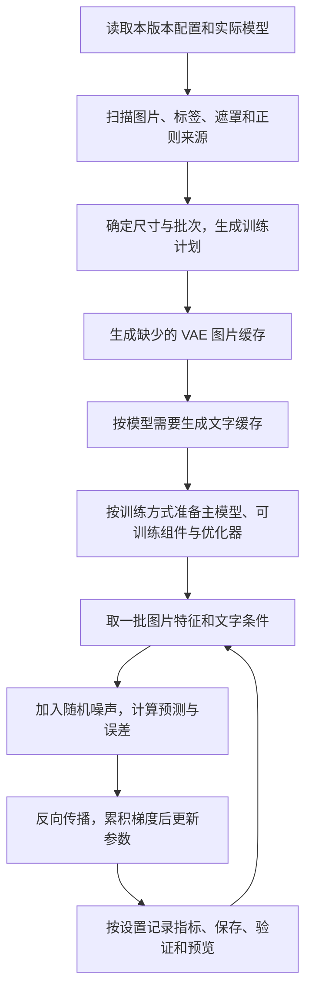

# 训练流程、分桶与三个参考训练器的对比

比较快照：2026-09-14；补充更新：2026-09-15（标签检查、FP8、DDP 与 FSDP2）。本文说明**代码实际怎么训练，以及这些选择会带来什么影响**。比较对象是 AnimaLoraStudio、sd-scripts、diffusion-pipe；简称 ALS、SD、DP。参考训练器仍按文末固定提交核对，未重新运行四个训练器的性能比赛。当前已有 [DDP 数据并行](TRAINING_DDP.md) 和 [FSDP2 显存分片](FSDP_TRAINING_2026-09-15.md)：前者在每卡保留完整训练副本，后者分配主模型参数、梯度和优化器状态。正式 Krea 2 双卡分片的容量、8 步训练、冷恢复执行及原生重载通过，逐位恢复一致性未通过；具体快照与边界见 [当前交付报告](DELIVERY_REPORT_2026-09-15.md) 和 [DTK 验收记录](DTK_ACCEPTANCE_2026-09-14.md)。

**我们的分桶不是直接调用 SD 或 DP，也不能称为“已经证明比三者更好的算法”。** 当前实现采用公共尺寸桶，并提供完整画面补边和逐图原生尺寸。相对参考代码，主要差别是保留画面的处理、缓存身份检查、项目工作流和模型加载安排；多卡、成熟训练选项及视频支持仍有明显差距。

阅读顺序：先看第 1～3 节了解训练和分桶，第 4～5 节看缓存及占用，最后看兼容与实测边界。源码入口集中在文末，正文只保留理解行为需要的参数名。

## 1. 四个训练器分别侧重什么

| 方面 | YPuddin（我们） | AnimaLoraStudio | sd-scripts | diffusion-pipe |
|---|---|---|---|---|
| 使用方式 | 项目、版本、数据编辑、训练、结果、XYZ 在同一 Web 工作区 | 围绕 Anima/Krea2 的可视化训练工作流 | 按模型分脚本，以配置和 CLI 为核心；其他 GUI 可包装它 | TOML、CLI、DeepSpeed，偏多模型研究与多卡训练 |
| 本文关注的模型 | Anima、Krea2 Raw、SDXL、Klein base 4B/9B | Anima、Krea2 | SD/SDXL、Anima 等；不能用别的 kohya 系项目补全这个仓库的能力 | 图像与视频模型较多，含 SDXL、Anima、Krea2、Flux2 |
| 常规图片进入桶 | 新 Web 配置默认等比缩放加补边；旧配置可裁切 | 等比覆盖后中心裁切 | 等比处理后中心或随机裁切 | 通用图片路径居中裁切 |
| 原生尺寸 | 逐图对齐与像素预算；按尺寸分组计算 | 有 native，尺寸规划仍接到公共缩放裁切路径 | `no_upscale` 是不放大分桶，不等于我们的原生组批 | 可显式列尺寸桶；不等于逐图原生预算模式 |
| 多卡 | 标准分桶 [DDP 数据并行](TRAINING_DDP.md) 与主模型全量微调的 [FSDP2 显存分片](FSDP_TRAINING_2026-09-15.md)；未实现模型流水线，组合限制见对应指南 | 本文核对的核心训练入口以单训练设备为主 | Accelerate 数据并行，具体受脚本限制 | DeepSpeed 模型流水线及数据并行 |
| 标签和遮罩 | TXT/逐图结构化 JSON、独立编辑、有效区 Mask、来源正则权重 | 结构化标签编辑、遮罩及正则数据工作流 | 标签处理、数据集配置及损失选项丰富 | TXT/目录级 captions.json、Mask、多 caption 展开 |
| 训练观察 | 训练/验证 loss、预览、XYZ、权重与完整状态 | 周期预览、可视化结果与 XY | 周期采样、日志、权重/状态；不自带我们的项目 Web 工作区 | 日志、验证 loss、权重/状态；未找到通用周期预览和 XYZ 工作流 |

这个表比较的是仓库中的实际入口，不是给所有模型、所有平台打“支持”勾。特别是 SDXL 与大文本编码器模型的缓存、LoKr、换出能力不能混为一谈。

## 2. 点击“开始训练”后，我们实际做什么

图中缓存是开启相应缓存时的路径。已有有效缓存会直接复用；关闭图片缓存后，就在取批次时用 VAE 编码。**普通训练会自动准备缓存，用户不必先去“训练缓存”页面手动点一遍。** 那个页面用于提前准备或检查耗时。

训练主体学习的是如何根据文字还原带噪的图片特征。LoRA/LoKr 模式通常冻结底模，只更新注入的适配器。图片不需要在磁盘上被改成桶尺寸，转换发生在读取/缓存阶段；原图仍保留。

### 先选择训练什么

| 训练方式 | 实际更新与保存 | 适合的用途 |
|---|---|---|
| LoRA / LoKr 适配器 | 冻结底模，更新附加的小型参数，保存适配器权重 | 训练角色、画风等可叠加效果 |
| 全量微调：只开主模型 | 直接更新整个 UNet / DiT，包括线性层以外的可训练参数 | 微调底模本身 |
| 全量微调：只开文本编码器 | 冻结主模型，更新文字条件模型；SDXL 包含两个文本编码器 | 改变文字条件的编码方式 |
| 全量微调：两者都开 | 同时更新主模型与文本编码器 | 需要共同微调的训练任务 |

“训练方式”位于参数流程中。选择全量微调后才显示两个组件开关，LoRA/LoKr 专属参数随之隐藏。Anima、Krea2、SDXL 和 Klein 均已接入这条真实训练链路。

训练文本编码器时，标签必须每步重新编码才能反向传播；界面会改为在线编码，并锁定不能同时使用的文字缓存和卸载选项。VAE 仍冻结，可以继续缓存图片特征。全量训练保留 FP32 的可训练权重，计算时可用混合精度；当前不支持对这些可训练权重使用 FP8 或层换出。它通常需要更多显存，不能用 LoRA 的占用推算能否训练整个底模。

### 同一个训练循环，不代表同一种训练目标

| 模型 | 实际学习的目标 | 对设置的影响 |
|---|---|---|
| Anima、Krea2、Klein | Rectified Flow：图片特征与噪声混合，预测两者的变化方向 | 可使用该模型支持的时间采样与 shift；Krea2/Klein 默认配方按图像 token 数调整 shift |
| SDXL | DDPM：按噪声日程生成输入，预测噪声 ε 或 v | 必须与所选底模的预测方式匹配；不能把 Flow 的 shift、加权公式直接套过来 |

SDXL 默认下载是光辉 Illustrious-XL v0.1，仍允许手选其他 SDXL 底模。提供 v 预测选项，不代表把 ε 模型勾成 v 后就自动变成正确的 v 模型。我们当前 SDXL 支持 ε/v 和末端零信噪比（zero terminal SNR），但**尚未接入 sd-scripts 那套完整 Min-SNR、debiased 等加权组合**；不支持的组合明确拒绝。

### “步数”“轮次”“重复次数”不是同一件事

- 一轮：按照当前数据计划走完一次训练项。
- 重复次数：增加某个来源在这一轮里出现的次数，不复制硬盘上的图片。
- 批大小：一次逻辑批次包含多少张图。
- 梯度累积：经过几批才更新一次参数。界面的训练步数按优化器更新计数，不按图片数计数。

例如 20 张图、两个基准分辨率、重复 3 次，桶模式展开为 120 个训练项；不是 120 次更新。批大小、梯度累积、桶尾部和验证排除还会改变最终步数。原生模式不按多分辨率列表复制图片，只保留重复次数。

## 3. 分桶：选尺寸与处理图片要分开看

**分桶解决的是“哪些图片用相同宽高一起计算”。它本身不保证不裁图。** 完整过程有三步：生成可用宽高 → 给每张图分配宽高 → 将原图放入这个尺寸。裁切、补边、放大通常发生在第三步。

### 3.1 我们如何生成和分配桶

新 Web 配置通常使用一个基准值 **1024**，含义是目标面积约 1024²，而不是统一正方形。默认候选桶在基准面积 ±10% 内，长边/短边比不超过 2，宽高通常以 64 像素步长生成。模型本身另有尺寸对齐要求：Anima/Krea2/Klein 为 16，SDXL 为 8；默认 64 步长同时满足这些要求。

给图片选桶时，我们先找最接近原图比例的桶，比例距离按对数计算；同样接近时再选面积更接近基准的桶。这样衡量的是比例的相对偏离，对横竖图采用同一种尺度。DP 也使用对数比例距离；ALS 和 SD 的常规桶选择使用绝对比例差。**这一处区别不能单独证明画质或速度更好。**

当前候选桶主要由配置生成，没有根据整个数据集训练一个聚类模型，也没有自动寻找“画质、裁切率、速度、显存”共同最优的桶集合。面积容差和宽高比上限由用户配置，狭长图会进入最近的边缘桶；不会仅因超出宽高比范围就自动跳过。

### 3.2 同一张图，最终究竟保留多少画面

以下例子已直接运行我们的尺寸 helper，并核对参考实现。原图 **1500×1000**，基准 1024；我们和 ALS 的这组设置都选到 **1280×832**：

| 路径 | 实际像素处理 | 原图画面是否完整 |
|---|---|---|
| 我们：完整画面 `pad` | 等比缩成 1248×832；左右各补 16 像素 | 完整保留构图；缩小会损失细节 |
| 我们：旧 `crop` | 等比缩成 1280×853；上裁 10、下裁 11 像素 | 上下少了一部分 |
| ALS：普通分桶 | 等比缩成 1280×853；上裁 10、下裁 11 像素 | 与这个旧裁切例子的尺寸结果相同 |
| DP：显式指定同一尺寸 | `ImageOps.fit` 先取原图 y=12.5～987.5 的区域，再缩到 1280×832 | 原图上下各少 12.5 像素对应的画面 |

DP 这一行是为了比较相同目标宽高而明确设置的尺寸桶，**不是 DP 默认自动生成这个桶**；其合法配置为 `size_buckets=[[1280,832,1]]`，最后一个数是帧数。ALS 这里以基准 1024、最大长宽比 2、step 64 计算。不同库的取整和重采样位置会有差异，不能据此声称输出逐像素一样。

我们补边时复制最邻近的边缘颜色，不把图片直接拉伸。程序同时生成“真实图片区域”的权重：纯补边位置不计直接训练误差，边界按覆盖比例计算。即使不开手绘遮罩，这个有效区仍然生效。

**补边仍会经过 VAE，也仍是模型看到的上下文。** 当前没有把这些 token 从注意力计算中删除。因此补边会占算力/显存，也可能影响上下文；“不计直接 loss”不等于“完全没有影响”。我们没有做出证明它在所有数据上都比适量裁切更好的对照实验。它首先解决的是保留用户原始构图的需求。

### 3.3 原生尺寸和“不放大小图”有什么不同

原生模式不先套公共桶，而是按每张图的尺寸安排画布。以 **1001×777、16 像素对齐、预算足够**为例：

| 路径 | 结果 | 容易被误解的地方 |
|---|---|---|
| 我们 `native + pad` | 画布 1008×784，图像本身不缩放，补齐边缘 | 保留画面，不代表模型完全不处理补边 |
| 我们 `native + crop` | 中心裁成 992×768，图像不重采样 | 向下对齐会丢边缘 |
| ALS native | 规划目标 992×768；随后公共像素路径缩成 992×770，再上下各裁 1 像素 | 规划标记“未超预算缩小”，也不代表像素阶段完全不缩放、不裁切 |
| SD `no_upscale` | 按原图、面积上限及步长推导桶，再裁掉对齐余量 | 限制放大，不是完整画面补边开关 |

我们的原生模式默认单图/分组像素预算 1,048,576、单边上限 4096；预算包括补边。超预算默认寻找能放入预算的等比缩小尺寸，也可选择直接报错。不会为保持名义“原生”而让任意大图无限增加占用。

一个逻辑批次允许不同宽高，程序实际按相同尺寸拆成几组，依次前向/反向，并按图片数合并梯度。**没有实现 NaViT 序列打包或专用变长注意力。** 尺寸种类很多时，计算组数也会增加，不能保证比公共桶快。

ALS 的 Anima 另有默认关闭的 NaViT 选项：把不同尺寸的 latent token 拼到一包中，并用块对角注意力隔离各图片。这是我们尚未实现的实际能力；它也有模型和功能限制，所核对路径会关闭 masked loss。“打包时不补齐整图”描述的是序列组织，不会取消前面已经发生的像素裁切。详细规则见 [原生尺寸说明](native-resolution.md)。

桶模式的“不放大小图”仍然先选桶，再缩小小图对应的目标桶；它与原生模式不是同一算法。关闭这一选项时，普通桶模式仍可能放大小图，完整画面模式也不例外。

### 3.4 四者桶和尾批的取舍

| 项目 | 候选尺寸与分辨率 | 一桶凑不满批次时 |
|---|---|---|
| 我们 | 面积容差网格；多分辨率按每张图每档展开；另有原生模式 | 单卡默认保留小尾批，不复制图片补齐 |
| ALS | 面积容差网格、绝对比例差；多分辨率也展开每图；另有 native | 普通训练保留小尾批、不复制补齐；NaViT 默认保留短包，可配置丢弃；普通累积按 micro-batch 均值合并 |
| SD | 预生成桶；`no_upscale` 可按原图推导更多尺寸 | 核心数据集可返回不足一批的尾部；分布式还需考虑 Accelerate 的跨进程分配 |
| DP | 手工/几何间隔 AR、面积档，或显式宽高帧桶；多面积档复制每图 | 每个尺寸桶向下截到全局 batch 的整数倍，小桶可能完全不参与 |

DP 例如一个桶有 10 条、全局 batch=4，就使用其中 8 条。它的全局 batch 还包括梯度累积和数据并行卡数。我们保留小尾批减少这类丢样本，但最后一批更新的样本数可能变少。桶更多不总是更好：构图更贴近的同时，批次利用率和缓存大小可能变差。

**默认兼容很重要：**新 Web 配方使用 `image_fit="pad"`；缺这个字段的旧 JSON/TOML 仍按 `crop` 读取，已有配置也不会被强行迁移。手写 CLI 配置希望保留完整画面，需明确填写 `pad`。主动更换几何模式后不能继续冒充原来的精确断点训练；可新建版本或从已有权重热启动。

## 4. 图片缓存、文字缓存与模型卸载

### 4.1 先把三个概念说清楚

| 名称 | 实际在做什么 | 代价与用途 |
|---|---|---|
| VAE 图片缓存 | 提前把训练图像转成底模使用的压缩特征，写到磁盘 | 首次要编码并占磁盘，之后训练可跳过重复 VAE 编码 |
| 文字缓存 | 提前把标签转成文字特征，写到磁盘 | 编完可释放文本编码器；动态标签变化受预先缓存的内容限制 |
| 每步编码（旧称“在线编码”） | 训练过程中在本机把当前标签送给文本编码器 | 能处理随步变化的标签，但需要编码器计算与驻留/搬运 |

这里的“在线”从来不是云服务，不会因此把图片、标签传到网上。缓存保存的是编码结果，不是另一份训练好的 LoRA。文本缓存模式下，随机标签可预先生成有限变体，变体数配置默认每图 8 份，去重后可能更少；不能把它称为每一步都产生无限新组合。

### 4.2 我们各模型的真实顺序

| 模型 | 默认文字方式 | 开启图片缓存时的准备顺序 |
|---|---|---|
| Anima | `auto` 选择每步编码 | 主模型先在 CPU 加载 → VAE 缓存后卸载 → 准备训练；Qwen 在训练需要时编码。显式选择文字缓存则先编码并卸载 Qwen |
| Krea2 | 文字缓存 | 先建空主模型结构 → VAE 缓存并卸载 → 文字缓存并卸载 → 再加载 DiT 真实权重 |
| Klein | 文字缓存 | 空主模型结构 → VAE 缓存并卸载 → 文字缓存并卸载 → 再加载 transformer 真实权重 |
| SDXL | 双 CLIP 文字缓存 | UNet 先在 CPU 加载 → VAE 缓存并卸载 → 双 CLIP 缓存并卸载 → 准备训练 |

所以我们当前是**先图像、后文字**。Krea2/Klein 的主要改进在于避免缓存时同时持有真实大主模型，以及明确释放编码器；不是靠把两个缓存阶段的先后调换一下就自动省很多内存。

Anima 每步编码时，默认没有开启“每次结束后搬回 CPU”。打开该选项会节省编码器常驻显存，同时增加搬运和电脑内存占用；它与彻底卸载编码器不同。关闭 VAE 图片缓存，也意味着训练阶段还需要 VAE，不能继续沿用“VAE 已离场”的占用估计。

### 4.3 对比三个参考实现

| 参考路径 | 源码中的顺序与例外 | 对我们的启发/区别 |
|---|---|---|
| ALS Krea2 | VAE 图片缓存 → 文字缓存 → 释放文本编码器 → 完成 DiT 加载；VAE 仍保留在训练设备；关闭文字缓存则不再延迟 DiT，改为每步文字编码 | 有阶段式加载，确实会释放文字模型；当前快照并不是先文字后图片 |
| ALS Anima | 先加载 DiT/VAE/Qwen，随后图片缓存；训练仍进行文字编码 | 不能把 Krea2 的缓存后释放方式推广到 Anima |
| SD 的 SDXL 网络训练 | 先加载 UNet/VAE/双 CLIP；开启缓存时先 VAE 后文字，缓存后的双 CLIP 移 CPU 并转 FP32 | 缓存文字要求只训练 UNet；编码器仍占 RAM |
| SD 的 Anima 网络训练 | 先准备 Qwen/VAE；执行启用的缓存阶段后再加载 DiT，缓存后的 Qwen 移 CPU、保留对象 | 它也已有延迟主干加载；移 CPU 不等于解除引用 |
| DP 通用路径 | VAE 缓存 → 逐个文字编码器缓存 → 清理辅助模型 → 加载主干 | 与我们的阶段顺序接近；普通模块、Comfy 包装模型释放方式不同 |
| DP SDXL 例外 | 初始化已加载整个 pipeline，未接入文字 embedding 缓存，文本编码器在线参与 | 不能用其 Krea2/Flux2 的内存安排估算 SDXL |

先做哪个缓存不是唯一关键。应检查峰值时**哪些模型和临时拷贝同时存在、卸载是否释放引用、主模型何时加载、预览是否重新加载编码器**。只看日志最后出现“cache completed”无法得出内存已经释放。

### 4.4 缓存失效与文件位置

我们用图片内容、实际几何、翻转方式、VAE 身份生成 latent 缓存键；文字内容和编码器/分词器文件身份生成文字缓存键。模型文件内容指纹有文件状态校验的哈希索引，首次计算仍有读取成本。旧裁切和完整画面缓存隔离，不能交叉冒用。

用户遮罩不固化在 VAE 缓存中：改遮罩时不必把同一张 RGB 图重新编码，但数据身份和精确续训检查仍会考虑标签、遮罩。缓存文件采用临时文件完成后再替换，避免并发读取半写入结果。

SD 的对应 NPZ 缓存检查重点是文件字段与尺寸；DP 的缓存按数据目录/模型名和数据集指纹组织，未在所核对路径中看到完整绑定每个 VAE/TE 文件内容的保护。替换编码器后不应一概相信同名旧缓存。这里是静态调用链差异，未针对所有缓存组合做四方破坏性试验。

ALS 的 latent 缓存检查图片修改时间、尺寸、编码格式等，Krea2 文字缓存检查 caption 和编码规格指纹；所核对路径没有把实际 VAE/TE 权重文件内容全部纳入身份。其遮罩存进 NPZ，修改遮罩会重建相应 latent，这与我们将遮罩单独读取不同。

项目训练数据、正则图、训练输出和可重建缓存是不同东西。我们按项目/版本保存来源及输出，缓存可以按内容共享；`repeats` 不产生原图副本。SD/DP 的一些缓存直接邻接数据文件或存到数据目录下，便于脚本查找，但复制数据时更容易顺带复制缓存。源码更新不应覆盖这些运行数据。

## 5. 显存、电脑内存与卸载：分别省的是什么

| 方法 | 减少什么 | 没有免费消失的部分 |
|---|---|---|
| 缓存后卸载编码器 | 训练时不再常驻 VAE/文字模型 | 缓存首次编码、磁盘空间、预览时重新加载 |
| FP8 冻结底模 | 减少底模权重存储 | 适配器、梯度、优化器、激活和反量化临时空间 |
| Block swap（分块换出） | 让部分冻结主模型权重暂放 CPU，需要时再送显卡 | RAM、CPU/GPU 传输；适配器与梯度仍在训练设备 |
| 激活检查点 | 少保存前向中间结果，反向时重新计算 | 额外计算时间；offloaded 变体另有 CPU 搬运 |
| 减小分辨率或 batch | 减少图片特征、注意力等中间计算 | 不会按同样比例缩小底模权重或文件加载峰值 |

### 底模存储精度与现成 FP8 文件

`memory.base_precision=auto` 沿用加载器提供的精度，不会因为显存变化而自动降精度。选择 FP8 时，程序只对适配器覆盖的、尚未量化的冻结线性层在启动时按逐张量最大绝对值计算缩放；原模型文件不改写。它是权重存储压缩，激活、适配器与优化器不会因此变成 FP8。前向计算时仍将权重解量化到计算精度后调用普通线性运算，并非原生 FP8 矩阵乘法，也不保证加速。

Krea2 加载器另支持 [Comfy-Org 发布的 Raw/Turbo `fp8_scaled` DiT](https://huggingface.co/Comfy-Org/Krea-2/blob/main/README.md)：保留文件中的 FP8 权重及每个张量的标量缩放，不重新量化。当前支持范围不是任意分通道、分块、MXFP8 或 NVFP4 文件。Krea2 单文件 FP8 Qwen 编码器会应用缩放后还原到计算精度，并非一直以 FP8 驻留。

Anima 的 DiT 与 Qwen 编码器目前拒绝直接加载现成 FP8 或带量化缩放的文件，预检和加载都会给出提示，防止直接转换精度时丢失缩放。应使用原始 BF16/FP16/FP32 权重；从高精度 DiT 启动时量化是另一条能力，不能用它推断现成 FP8 格式也被支持。其他模型族各有加载限制，不共享 Krea2 的支持承诺。

Windows 的正式 Krea2 FP8 短训证据见 [Windows 验收](WINDOWS_ACCEPTANCE_2026-09-14.md)。海光上的小矩阵 FP8 量化、反量化和反传通过，只证明这条运行时计算路径，不能代替正式 FP8 模型训练或画质验收。

### 梯度检查点与梯度累积

梯度检查点减少前向中间结果的保存，在反向传播时重算模型块，用额外计算换显存；它不改变有效批量，也不是用于恢复训练的存档。梯度累积则连续处理多个小批次并累加梯度，达到设定次数后才更新优化器，可以在不同时放入大批图片的情况下增大有效批量。正常完整批次下，有效批量为每卡 batch × 累积次数 × 数据并行卡数；尾批按实际参与的样本处理。

这两个选项独立，在支持梯度检查点的单卡路径可同时使用。当前 DDP 支持梯度累积，但不支持梯度检查点，配置检查会明确拒绝，详见 [DDP 支持范围](TRAINING_DDP.md#当前支持范围)。FSDP2 支持梯度累积，并可选择逐块梯度检查点（`block`）或关闭（`none`）；每次微批次都归约梯度，在本卡分片上累积，详见 [显存分片指南](FSDP_TRAINING_2026-09-15.md)。

### 我们的换出与 Krea2 准备过程

换出选择最后 N 个模型块的冻结参数和 buffer；前向、重算、反向都有相应搬运处理，CUDA 使用专门的传输流与预取。每个块按精度打包到独立的主机存储，避免大量小 pinned 分配。它不会把优化器和可训练 LoKr 因子一起自动搬走，也不是任意时刻整块显存占用都为零。

Krea2 读取真实 FP8 权重/缩放格式后，检查空闲显存：如果能容纳实际主模型张量并额外留出 2 GiB，就允许在准备阶段临时将整模放 GPU，再建立 CPU 换出存储，错开大的 RAM 副本。否则保留 CPU 准备路径。**这个判断只影响加载安排，不会自动修改分辨率、batch 或 swap 数。**

这部分还修正了 FP8 缩放张量持有旧文件映射、以及主机存储分配造成的准备峰值。实际过程和预算公式见 [Krea2 内存说明](KREA2_MEMORY.md)。这不是通用“16GB 保证能跑 1024”的承诺：Windows 共享显存、其他程序和预览都可能改变结果。

精度也要分别看：底模存储、前向计算、适配器参数、导出文件不是一个设置。我们的适配器参数默认 FP32；ALS 默认通常随模型使用 BF16，DP 的通用 adapter 默认随模型 dtype。即便写着相同的 rank/batch，参数、梯度和优化器空间也可能不同。把导出精度改成 BF16，不会自动减少训练中这些占用。

### 与参考训练器的差异

ALS 也有逐块换出和针对模型的加载优化：两个 GPU 槽复用存储，CPU 用打包的 pinned 存储；Krea2 加载器还能按放置计划将待换出层直接放到 CPU，其余层送 GPU。我们的方案是先加载再建立逐块主机副本，Krea2 另加条件式 GPU 暂存。二者准备过程并不一样，不能把“我们有 swap”写成独有优势，或仅凭代码判断哪一种整体峰值更低。SD 的能力要按具体训练脚本判断，Accelerate 多卡主要把不同数据分给各卡，通常每卡仍要容纳模型，不等于自动把大模型拆小。DP 的 DeepSpeed pipeline 则能把一个模型拆成多个 GPU stage；我们尚未实现这种流水线，但已有 FSDP2 参数、梯度与优化器状态分片，计算当前模块时临时收集所需参数。

DP 的 block swap 入口要求单 pipeline stage 且为 adapter 训练，不能想当然地与多 stage 全部叠加。我们当前也有明确限制：**DDP 与 FSDP2 均不支持 block swap 或 compile；SDXL 单卡也未提供 block swap；单卡 compile 与 block swap 不能同时启用；`fused_backward` 尚未实现。** 已有多卡训练链路和指定配置的海光实测，但环境页面检测到多卡/NCCL 仍不代表任意训练组合都通过，详见 [DDP](TRAINING_DDP.md) 与 [FSDP2](FSDP_TRAINING_2026-09-15.md) 的支持范围。

计划面板的显存数字是估算，用于配置和队列判断；PyTorch CUDA 分配器峰值是运行观测；Windows 专用显存和进程树 RAM 又是别的指标。不能把它们互相替代，更不能拿一次低分辨率峰值当所有配置的保证。

## 6. 标签、遮罩、正则：名字相近，训练权重可能不同

### 标签与重复次数

我们支持同名 TXT 和结构化 JSON。自动格式优先 JSON，损坏 JSON 会报错；不会偷偷换用 TXT 掩盖格式问题。结构化 JSON 按支持的分类、固定标签和自然语言语义处理，不能把整个对象串当普通标签。已经在打标时写好的触发词直接读取，不需要再填写一次。前后缀/触发词的旧高级字段仍为兼容保留。详见 [JSON 标签契约](JSON_CAPTIONS.md)。

ALS 也有针对结构化 JSON 的处理。SD 的标签数据路径和 DP 的目录级 `captions.json` 并不是同一种 JSON 协议；“都支持 JSON”不代表可以不转换地互换。DP 的多个 caption 还会展开样本，可能改变每图实际训练次数。

重复次数本质是训练采样权重，无法从图片内容自动判断“这个概念应该重复 5 次”。当前我们读取登记的数据源或配置中的 `repeats`，默认 1；**不会把任意目录名开头的数字自动当重复次数**。目录名可能是序号，直接猜会改变训练分布。SD DreamBooth 的旧式目录入口会解析 `次数_类别`；ALS 会解析 `[分辨率px_][次数_]名称`。这是明确约定后的自动解析，不是从图片猜训练强度。我们当前没有接入这两套目录前缀协议，迁移数据时要把所需重复次数登记到来源配置。

### 遮罩不是删除原图里的物体

白色部分参与监督，黑色部分不直接计算误差，灰色按比例加权；RGB 仍完整进入模型。用户遮罩与图片使用同一几何和翻转，再与补边有效区相乘。它用于告诉训练“重点算哪里”，不等于抠掉背景、也不保证模型绝不学到背景。

我们先对每张图的有效区域求平均，再按样本权重合并。因此遮罩只剩四分之一面积时，不会单纯因为面积变小就把该图的误差自动压成四分之一。参考实现归一化方式有区别：SD 所核对网络训练和 DP 默认 Mask 路径都是乘遮罩后对全空间平均，小遮罩同时降低整体损失；ALS 所核对损失路径按整个 batch 的有效像素总量归一。切换训练器时不能只搬同一个 `mask=true` 开关，就假定各图片权重完全一致。

### 正则图与 prior 权重

正则图是用来保留底模对一般类别的表现，通常与目标训练图混合使用。我们根据本版本已管理的训练/正则目录识别来源，不要求用户反复说明已知目录是什么。外部来源仍保留明确的配置。

我们没有自动把主体与正则配成一比一。出现比例由两边图片数、重复次数、分辨率展开决定；`prior_weight` 再乘到正则图片的损失上。例如正则图原误差为 0.8、权重 0.25，该图加权后贡献为 0.2，再进入批次平均。权重 0 仍占批次位置，不等于从数据集删除。

SD 的 DreamBooth 路径除了 prior 权重，还会调整正则图片的实际曝光次数，使其接近或达到主体曝光，正则图过多时也可能只用其中一部分。这与我们、ALS 直接串接主体和正则再按桶混合的做法不同，迁移相同 repeats 时不一定得到相同训练比例。DP 当前通用路径可混入其他目录并调整 repeats，但未找到同等的 `is_reg` 加独立 prior 权重机制。单纯减少某来源出现次数与每次降低它的梯度权重，也不完全等价。

还有一个固定快照差异：ALS 此提交虽然允许正则权重为 0，数据阶段却用 `or 1.0` 把它改回 1。不能将我们“0 不贡献该图损失”的语义直接套给这份参考版本；这是源码读取结果，未修改或运行其训练来做数值复现。

## 7. LoKr full、v4 加速与文件兼容

**LoKr 的 full 指因子使用完整矩阵，不是训练整个底模。** 它仍通过较小的 Kronecker 因子表达权重增量。例：3072×3072 线性层，平衡分解后两个因子为 48×48 和 64×64，共 6400 个参数；完整底层矩阵有 9,437,184 个参数。不同层和 factor 的数字会变，不能把这个比例推广到整个模型。

| 名称 | 含义 |
|---|---|
| `algo=lokr, rank=full` | LoKr 因子不再继续做低秩拆分 |
| `algo=full` | 旧版线性层差分模式；仍取决于适配器作用范围 |
| `training.mode=full` | 新的全量微调入口，直接更新勾选的整个主模型或文本编码器 |
| `preset=full-linear` | 扩大被选中的线性层范围，不替代 LoRA/LoKr 算法 |

我们这里两个因子都为完整矩阵时，基础缩放为 1，alpha 不再按低秩 rank 的规则缩放；文件和层尺寸也必须一起看。ALS/SD/DP 的 full 入口形式各不相同，不能简单把 `rank=full` 原样复制到它们的配置中。

我们当前普通 LoKr 在 PyTorch 中通过分解后的矩阵乘法算增量，不在正常 bypass 前向里构造完整 ΔW；DoRA 或合并权重等路径仍需重建。运算顺序不同会影响成本和舍入，不能仅据此承诺更快或逐位一致。

ALS 固定了 LyCORIS v4，默认后端仍是 Torch：常规 BF16 LoKr 默认重建 ΔW，FP8 底模路径才强制 bypass。因此不能把版本号当成已启用融合加速。

ALS 使用的 LyCORIS 路径、SD 当前仓库的原生 `networks.lokr`、DP 的 `PEFT.LoKrConfig` 都不能仅凭名字视为同一个运算后端。SD 当前原生 LoKr 已存在，旧报告若写“只能装外部 LyCORIS”就不准确；该内置模块当前自动识别 SDXL/Anima，其已核对前向会构造 `torch.kron` 增量；其他模型不能据此推断支持。DP 的通用 LoKr 配置不代表其独立 SDXL 分支也支持，后者目前明确只接 LoRA。

LyCORIS v4 的 Triton 融合路径已经独立测试，但**没有设为产品默认**。Windows RTX 5070 Ti 上，Krea 层尺寸的单层 BF16 热态墙钟对照中，当前 PyTorch 前反向中位数约 0.851 ms，候选 Triton 约 2.381 ms；候选少分配约 12 MiB 临时 CUDA 空间，却更慢，并有因子梯度未通过固定容差。factor8/16 的部分形状超过候选内核限制。

这只是指定形状、tokens、精度、硬件的单层实验，不是所有 v4 后端或完整训练的评价。正式 LoKr full 短训与导出兼容属于现有路径；外部 LyCORIS 的实际 Kohya 加载器已完成 12 项读取/前向检查。两类证据分别见 [Windows 验收中的 LoKr 专节](WINDOWS_ACCEPTANCE_2026-09-14.md#lokr-full-兼容与-v4-加速)。

## 8. 采样、XYZ、保存和恢复

### 三种“调度器”不要混用

| 设置 | 影响什么 |
|---|---|
| 训练时间采样 | 每张训练图片被加到多大噪声，模型练习哪些噪声阶段 |
| 学习率调度器 | 参数每次更新的幅度怎样随训练进度变化 |
| 预览采样器和采样调度器 | 从噪声出图时用什么求解办法、经过哪些时间点 |

Euler、Heun、ER-SDE 是不同求解办法，不是画质的一二三级。Heun 通常增加一次校正评估，计算量也更高；步数增加或求解阶数更高不保证更好。我们的 Flow 模型提供 Euler/Heun/ER-SDE 以及四种时间网格，**SDXL 当前仅 Euler/Heun 和 uniform 网格**，不能在所有模型上套用同一张采样器菜单。

XYZ 用于固定其他条件、比较步数/CFG/种子/强度/权重等坐标，保存各格和拼图。我们已验证 Krea2 Raw 训练后的 adapter 在单独 XYZ 任务中选择已登记 Turbo 出图；不会因此把 Raw 训练底模改成 Turbo。Turbo 缺省 8 步/CFG0 是其预览配置，不是 Raw 的训练参数。两个模型路径的图像差别也不能只归因为 LoRA 强弱。

ALS 当前公开的是 **XY 对比**，轴包括 LoRA 强度、步数、CFG、checkpoint；没有公开的 Z/种子轴。它的常驻生成进程和优先在外层循环切换昂贵权重的安排有助于减少重复加载，是值得参考的设计；具体加速幅度本次没有对照实测。SD 的周期采样在训练脚本中；DP 的验证主要计算 held-out loss，还存在开发用 `--test_sample`，但不是同等的周期预览/XYZ 产品流程。

训练预览需要时会重新加载 VAE/文本组件，因此可能比纯训练阶段占用更高。我们隔离预览的随机状态并恢复训练状态，但不能承诺切换显卡、内核或依赖版本后每一位数值都一样。

### 权重文件与完整训练状态用途不同

推理权重可用于出图或热启动；完整 state 另外保存优化器、随机数、数据位置等，用于续训。改数据、编码器或几何模式可能使精确恢复被拒绝。文件默认根据项目名和版本命名，输出按项目/版本/运行 ID 隔离，避免两次训练互相覆盖。

全量微调保存为 `.model` 目录，含所选组件的原生权重、组件配置、清单及复用配置；结果页可打包下载 ZIP。未参与训练的 VAE、分词器等资源继续引用原模型，这不是包含所有依赖的独立模型包。重新开始训练可选择该目录中的组件；要接着原训练进度继续，则恢复完整训练状态。

界面当前 Loss 是最近一次记录的更新损失；平均 Loss 是成功优化器更新的累计算术平均；图表显示 EMA 只平滑曲线；验证 Loss 是保留数据上的另一次评估。**这些指标不能互相替代，也不能用不同模型/噪声分布的 loss 大小直接排画质。** 小尾批存在时，优化步平均也不等于全程所有图片的总体平均。

## 9. 哪些已经验证，哪些仍需继续做

正式权重的 Windows 单卡验收见下表。全量微调另做了五个模型族的缩小架构验收：主模型、文本编码器、共同训练共 15 组，核对参数变化、采样、原生组件回读及精确续训；这些测试验证训练链路，不代表官方大模型的显存与画质测试。其他三个训练器没有在同一台机器上重做性能比赛。

| 已有证据 | 能说明什么 | 不能推导什么 |
|---|---|---|
| Anima 1024、SDXL 768/1024、Klein 4B 512/768/1024、Krea2 Raw FP8 256～1024 的所列短训 | 指定配置完成加载、缓存、前反向、保存及采样/复载 | 数小时稳定、收敛、画质最好、所有 rank/batch 可行 |
| Krea2 768 冷缓存准备峰值修复 | 在该机指定配置下解决了曾经触发的 RAM 低余量中止 | 只降分辨率能解决所有加载内存问题 |
| Raw→Turbo 八格、Anima checkpoint 轴、Klein 四格 | 对应 adapter/模型切换和采样产物链路实际运行 | 两步 LoRA 已学会目标，或全部 XYZ 组合穷举通过 |
| 完整状态读取与确定性对照 | 训练张量、优化器、RNG 能准确恢复；显式确定性策略的对照一致 | 默认 GPU 两条独立训练路径天然逐位一致 |
| LoKr 文件外部加载及单层融合专项 | 指定导出文件兼容、候选后端的形状/数值/成本有实测 | 融合加速已在整个产品开启或一定更快 |

硬件为 RTX 5070 Ti 16GB、系统 RAM 32GB。Krea2 1024 用例 CUDA 分配器峰值约 16,359 MiB，不能据此声称全程只使用专用物理显存。Klein 9B、多卡、长时间训练以及各高级参数组合，仍不能借用这些短测作为已通过证据。具体配置、失败、修复与数值见 [2026-09-14 Windows 验收](WINDOWS_ACCEPTANCE_2026-09-14.md)。

### 对我们当前方案的评价

已经有明确实现的取舍是：新项目默认完整画面、原生模式不强行放大小图、单卡保留尾批、几何/编码身份参与缓存、Krea2/Klein 缓存后加载主干、项目结果与数据隔离。它们分别解决构图、重复计算、峰值占用和工作流问题。

尚未证明的是：整体分桶画质或吞吐优于 ALS/SD/DP，补边在所有任务都优于裁切，以及 v4 融合对我们常用配置能加速。当前已实现 DDP 数据并行与 FSDP2 显存分片；仍欠缺的是模型流水线、更广的多卡组合和平台验收、SDXL 更完整的训练选项、按实际数据分布自动优化桶，以及充分的长训验收。后续要评价“优化”，应固定同一底模、数据、有效训练次数、目标层和采样条件，同时记录构图保留、每图耗时、准备/训练/预览峰值及最终图像，不能只比较一个 loss 或一张进度截图。

## 10. 源码快照与查证入口

本次参考目录均无未提交修改；未拉取三者上游。以下是固定快照，不声称代表未来版本。我们以审计开始时的代码提交为基准；本报告与随后品牌图标修改不改变训练算法。

| 仓库 | 核对提交 |
|---|---|
| YPuddin | `d4dcc7f3e7ba0144216ee57aea5b4835e7e0770f` |
| AnimaLoraStudio | `3d9d2e86045b879cd19c01ac4aa2337f45a283ab` |
| sd-scripts | `4e624302e0088e39933b31cbc71f24212e900f5f` |
| diffusion-pipe | `8f83dbf25d03219df705570ec03e62be04bc402f` |

### 本项目

| 核对主题 | 主要源码 |
|---|---|
| 调用顺序、缓存卸载、原生组批、loss、恢复 | [训练循环](../ypuddin/train/trainer.py)、[状态](../ypuddin/train/state.py) |
| 新项目默认与旧配置兼容 | [模型配方](../ypuddin/server/family_config.py)、[配置定义](../ypuddin/config/schema.py) |
| 选桶、真实图片变换、原生尺寸 | [buckets](../ypuddin/data/buckets.py)、[images](../ypuddin/data/images.py)、[native](../ypuddin/data/native.py) |
| 展开训练项、尾批、缓存与数据身份 | [dataset](../ypuddin/data/dataset.py)、[sampler](../ypuddin/data/sampler.py)、[cache](../ypuddin/data/cache.py)、[编码器指纹](../ypuddin/models/fingerprints.py) |
| 训练目标与 Mask/prior 归一 | [Flow](../ypuddin/objectives/flow.py)、[DDPM](../ypuddin/objectives/ddpm.py) |
| 模型间差异 | [Anima](../ypuddin/models/anima/family.py)、[Krea2](../ypuddin/models/krea2/family.py)、[SDXL](../ypuddin/models/sdxl/family.py)、[Klein](../ypuddin/models/flux2/family.py) |
| 冻结权重换出与 LoKr | [block swap](../ypuddin/memory/block_swap.py)、[LoKr](../ypuddin/adapters/lokr.py) |
| 来源目录与输出 | [source roles](../ypuddin/server/source_roles.py)、[output binding](../ypuddin/server/output_binding.py)、[context](../ypuddin/server/context.py) |
| 采样与 XYZ | [Flow 采样](../ypuddin/sampling/dispatch.py)、[SDXL 采样](../ypuddin/sampling/ddpm.py)、[XYZ 服务](../ypuddin/server/xyz.py)、[XYZ worker](../ypuddin/server/xyz_worker.py) |

### 参考实现（固定提交链接）

- ALS：[尺寸规划与真实转换](https://github.com/WalkingMeatAxolotl/AnimaLoraStudio/blob/3d9d2e86045b879cd19c01ac4aa2337f45a283ab/runtime/training/dataset.py#L67)。另见 [阶段入口](https://github.com/WalkingMeatAxolotl/AnimaLoraStudio/blob/3d9d2e86045b879cd19c01ac4aa2337f45a283ab/runtime/anima_train.py#L117)、[缓存与组批](https://github.com/WalkingMeatAxolotl/AnimaLoraStudio/blob/3d9d2e86045b879cd19c01ac4aa2337f45a283ab/runtime/training/phases/dataset.py#L190)、[模型加载](https://github.com/WalkingMeatAxolotl/AnimaLoraStudio/blob/3d9d2e86045b879cd19c01ac4aa2337f45a283ab/runtime/training/phases/models.py#L278)、[文字缓存](https://github.com/WalkingMeatAxolotl/AnimaLoraStudio/blob/3d9d2e86045b879cd19c01ac4aa2337f45a283ab/runtime/training/phases/text_cache.py#L80)、[Mask 损失](https://github.com/WalkingMeatAxolotl/AnimaLoraStudio/blob/3d9d2e86045b879cd19c01ac4aa2337f45a283ab/runtime/training/loop.py#L128)、[LoKr 包装](https://github.com/WalkingMeatAxolotl/AnimaLoraStudio/blob/3d9d2e86045b879cd19c01ac4aa2337f45a283ab/utils/lycoris_adapter.py#L178)、[公开 XY 轴](https://github.com/WalkingMeatAxolotl/AnimaLoraStudio/blob/3d9d2e86045b879cd19c01ac4aa2337f45a283ab/studio/domain/xy_matrix.py#L27)。
- SD：[数据集、选桶和缓存使用](https://github.com/kohya-ss/sd-scripts/blob/4e624302e0088e39933b31cbc71f24212e900f5f/library/dataset.py#L251)、[桶生成](https://github.com/kohya-ss/sd-scripts/blob/4e624302e0088e39933b31cbc71f24212e900f5f/library/model_util.py#L1388)、[原生 LoKr](https://github.com/kohya-ss/sd-scripts/blob/4e624302e0088e39933b31cbc71f24212e900f5f/networks/lokr.py)、[正则曝光调整](https://github.com/kohya-ss/sd-scripts/blob/4e624302e0088e39933b31cbc71f24212e900f5f/library/dreambooth_dataset.py#L324)、[缓存及网络加载](https://github.com/kohya-ss/sd-scripts/blob/4e624302e0088e39933b31cbc71f24212e900f5f/train_network.py#L1017)、[SDXL 文字缓存](https://github.com/kohya-ss/sd-scripts/blob/4e624302e0088e39933b31cbc71f24212e900f5f/sdxl_train_network.py#L118)、[Anima 延迟加载](https://github.com/kohya-ss/sd-scripts/blob/4e624302e0088e39933b31cbc71f24212e900f5f/anima_train_network.py#L101)。
- DP：[分桶、展开、截尾及缓存](https://github.com/tdrussell/diffusion-pipe/blob/8f83dbf25d03219df705570ec03e62be04bc402f/utils/dataset.py#L347)、[ImageOps.fit 与默认 loss](https://github.com/tdrussell/diffusion-pipe/blob/8f83dbf25d03219df705570ec03e62be04bc402f/models/base.py#L41)、[缓存后加载及流水线](https://github.com/tdrussell/diffusion-pipe/blob/8f83dbf25d03219df705570ec03e62be04bc402f/train.py#L516)、[SDXL 例外](https://github.com/tdrussell/diffusion-pipe/blob/8f83dbf25d03219df705570ec03e62be04bc402f/models/sdxl.py#L371)。

上述对比来自本地源码审查与明确列出的几何计算；reference 子目录里的更早报告属于历史材料。如果它们与本次已核实的快照不同，以对应日期和提交为准。
