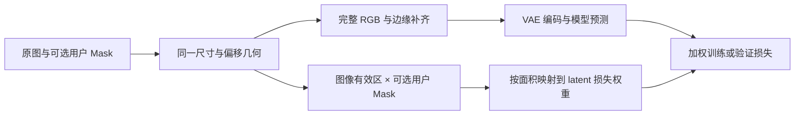

# v0.5.6：完整画面训练与工作区交付说明

记录日期：2026-09-12。本文记录本轮源码实现、兼容边界和自动测试证据，不用历史版本的测试数量替代本轮验收。最终浏览器、发布包及正式服务状态由交付验收另行追加；本文初稿不宣称已完成这些步骤。

## 本轮实际变化

| 范围 | 已实现行为 | 主要源码 |
| --- | --- | --- |
| 自定义训练预设 | 移除用户可见内置预设，独立页面只管理自定义项；保留新建、编辑、复制、删除、参数分区与未保存保护 | `server/routes_core.py`；`frontend/src/pages/Presets/Presets.tsx` |
| 数据来源 | 当前版本 `traindata` / `reg` 按真实目录归属确定用途；标签格式集中到标签区域，高级来源字段折叠 | `server/source_roles.py`；`server/routes_work.py`；`schema/SchemaForm/SchemaForm.tsx` |
| 图像适配 | Web 新项目默认完整等比适配、补边与有效区损失；保留旧裁切与原生模式 | `data/buckets.py`、`images.py`、`native.py`、`dataset.py`；`train/plan.py`、`trainer.py` |
| 输出命名 | 默认权重名前缀在项目任务入队时生成“项目显示名_v版本号”，保留自定义名和每任务目录隔离 | `server/output_binding.py`；`server/routes_work.py` |
| 彩色绘制与 Mask | 两个独立画层，同一次保存提交；原尺寸、透明度、版本锁、冲突保护、备份与撤销贯通后端 | `components/masks/ImageEditor.tsx`、`paintDocument.ts`、`paintApi.ts`；`server/routes_dataset_paint.py` |
| 本地模型探测 | 读取真实权重头、配置与分片索引，识别组件、兼容候选及实际精度；未知不按文件名猜测 | `server/model_inspection.py`；`pages/Models/LocalModelRegistration.tsx` |
| 环境能力说明 | 分开显示 CUDA 构建/运行、设备数、分布式/NCCL 包能力与本项目单设备训练策略 | `server/environment.py`；`components/EnvironmentManagerPanel.tsx` |
| 训练监控 | 七项核心指标、实际累计平均 Loss、多参数组学习率、冻结的终态时长、紧凑文件记录 | `train/trainer.py`；`server/supervisor.py`；`pages/JobDetail/JobDetail.tsx` |
| 侧栏与动效 | 可记住的侧栏收起状态、界面偏好面板、弹窗/抽屉进入退出、减少动态效果支持 | `components/Layout.tsx`、`useAnimatedClose.ts`；`styles/motion.css`、`project-sidebar.css` |

表中后端路径以 `ypuddin/` 为根；省略 `frontend/src/` 的前端组件路径均位于该目录。详细参数含义见 [训练参数说明](TRAINING_PARAMETERS.md)。

## 完整画面训练是数据与损失链路的修改

分桶仍按接近原图长宽比的候选尺寸分配；1024 指目标面积约 1024²。新 `dataset.image_fit="pad"` 把完整图像等比缩放并居中，RGB 空余区域复制边缘像素；`crop` 保留旧版覆盖后中心裁切。新项目默认分桶基准仍为 `[1024]`，没有改成较低分辨率。

原生模式继续存在。`native + pad` 以每张图片的实际尺寸向上对齐，预算包含补边；超限可等比缩小或报错，不放大小图。`native + crop` 沿用旧向下对齐及裁边规则。原生逻辑批次按尺寸与像素预算拆成前向组，按图片数累积梯度，未新增 NaViT 序列打包。

有效区不依赖用户 Mask 开关：关闭 `masked_loss` 也不会给纯补边单元直接损失。开启用户 Mask 后，几何变换与图像同步，权重再乘有效区。在线图像编码、已缓存 latent、训练及验证共用这一逻辑；边界 latent 单元按有效面积加权。

**补边仍会影响模型上下文。** VAE 与 DiT 仍看到补边内容，代码没有删去补边 token 或隔离其注意力。此实现保证不把纯补边区域当作直接监督位置，不保证与完全无补边训练等价，不保证质量、吞吐或显存收益。保持完整画面也不等于保持原始细节：超预算缩小仍会损失细节。

数据计划使用真实训练项几何，报告有效区域、缩放尺寸、补边/裁切像素与比例；明细上限为 100 种组合，汇总不因此截断。缓存键为 `pad` 加入适配尺寸与 `whole-image-pad-v1` 标记，防止复用旧裁切 latent。旧 `crop` 的缓存键与缺省数据指纹保持原格式；换适配方式会改变数据身份，不能绕过完整恢复检查。

兼容范围：`DatasetConfig` 缺省仍为 `crop`，旧 JSON/TOML 没有该字段时继续旧行为；`initial_family_config` 才显式设新项目 `pad`。复制旧配置或跨族保留数据准备设置时，不会悄悄把旧裁切改成补边。CLI 或手写配置希望完整画面时，应显式填写 `image_fit="pad"`。

源码证据：[`buckets.py`](../ypuddin/data/buckets.py)、[`images.py`](../ypuddin/data/images.py)、[`native.py`](../ypuddin/data/native.py)、[`dataset.py`](../ypuddin/data/dataset.py)、[`plan.py`](../ypuddin/train/plan.py)、[`family_config.py`](../ypuddin/server/family_config.py)。

### 数据布局预览不再依赖采样词等完整训练参数

采样已开启但提示词为空、优化器数值无效等草稿，仍先保留完整 `TrainConfig` 校验错误和 `ok=false`，再独立验证数据、验证集配置与明确的已知模型族。只有这些布局输入有效时，才调用训练共用的 `prepare_data_layout`，展示真实图片选择、重复项、分桶/原生尺寸及填充明细；不会修正原草稿、实例化模型或伪造参数/显存估算。验证集划分或来源非法时不拿全部图片冒充训练集，未知模型族不猜测对齐尺寸。

有效的训练循环可继续计算步数；循环配置无效时省略步数估算。原生混排的前向次数依赖随机种子，种子非法时仍展示真实尺寸与像素预算，但 `PlanBucket.batches` 和 `NativePlan.forward_groups` 返回 `null`，界面显示“—”。正常有效配置的几何和步数保持原结果。

`/config/validate` 和任务入队仍严格校验完整配置；出现这些错误时启动按钮保持禁用。回归包含实际上传 8 张图后，缺少采样词仍返回布局，同时 `/jobs` 拒绝请求且不新增任务。这个预览是数据准备反馈，不是训练配置已通过或模型能够开训的证明。

### 三个参考训练器的源码事实

以下按本机 2026-09-12 的参考副本核对。路径从父目录起，参考仓库不属于本项目发布包；行号会随参考更新变化。比较针对图片真正送入编码器前的像素处理，不把 token padding 与图片补边混为一谈。

| 参考 | 桶/尺寸规则 | 像素路径与裁切事实 | 具体位置 |
| --- | --- | --- | --- |
| AnimaLoraStudio | 面积 ±10%、step=64、绝对长宽比差，面积差打破平局 | 分桶使用 resize-cover + 中心 crop；native floor-16 也裁掉对齐边缘；“零 padding”并非“无裁切” | `AnimaLoraStudio/runtime/training/dataset.py:193–245`、`:67–90`、`:764–797` |
| sd-scripts | 预生成候选尺寸，按绝对长宽比差选桶；no-upscale 根据源尺寸/面积另行推导 | 普通路径中心或随机裁切；no-upscale 向下对齐并明确以 cropping 代替 padding | `sd-scripts/library/model_util.py:1388–1416`；`library/dataset.py:251–306`；`library/utils.py:206–226` |
| diffusion-pipe | 显式或几何间隔 AR，按对数距离选择，按面积求宽高后对齐 | `ImageOps.fit` 做中心裁切；未指定尺寸桶时仍会对齐再 fit；Mask 同步 fit | `diffusion-pipe/utils/dataset.py:419–424,495–507,809–818`；`models/base.py:41–53,166–186` |

本项目保留面积带与对数长宽比选择的独立实现，新增完整画面几何与有效区损失。上表说明参考差异，不宣称逐像素兼容或照搬它们的实现；未复制 GPL 参考流水线源码。既有模型 vendor 和采样器的来源、许可证按各自 NOTICE / provenance 文档保留。

## 预设、来源、标签与输出的真实语义

`GET /presets` 只返回磁盘保存的自定义预设；未保存的旧内置名称 GET/resolve 返回不存在。原内置名称不再保留，用户可自行用这些名称创建配置，已有自定义文件不删除。模型族 `family.presets()` 仍用于选择适配器目标层，模型默认配置也保留；它们与用户训练参数预设是两套机制。

预设页用参数编辑区管理可复用设置，保存失败保留草稿，切换/离开有未保存保护；从项目加载预设仍保留该版本模型文件、训练/验证来源与项目路径。界面去掉内置展示没有取消这些隔离规则。源码：[`routes_core.py`](../ypuddin/server/routes_core.py)、[`Presets.tsx`](../frontend/src/pages/Presets/Presets.tsx)、[`trainingPresets.ts`](../frontend/src/utils/trainingPresets.ts)。

来源用途依据当前版本真实目录祖先关系确定，而非文本中是否包含 `reg`。版本 `reg` 属正则图，layout 2 的 `traindata` 属训练图；其它版本、外部路径和旧布局不靠目录名字猜测。外部源显式设置保留；缺省时可使用本版本已有注册元数据。GET/PUT 配置、带项目上下文的 Plan/validate、入队、复制与导入使用一致规则；离线无项目配置仍按原配置处理。正则的 `prior_weight` 仍是单图损失倍率，不是采样比例，不新增主体/正则一一配对。

来源格式控件进入标签区；`prefix/suffix/trigger_word` 移高级，旧值继续生效且普通视图提示额外改写。`keep_tokens` 随 shuffle/tag dropout 有意义时显示。文本编码、图像缓存、编码器卸载等移高级，默认不变；“每步处理”和“训练前缓存”都在用户训练电脑本地执行。无新增自动打标能力。源码：[`source_roles.py`](../ypuddin/server/source_roles.py)、[`schema.py`](../ypuddin/config/schema.py)、[`SchemaForm.tsx`](../frontend/src/schema/SchemaForm/SchemaForm.tsx)。

权重默认名前缀在**新项目任务入队**时绑定安全的“项目显示名_v数字”。清理路径/Windows 禁止字符和保留名，限制为 120 字符且最多 180 UTF-8 字节，为步数/后缀预留空间；非默认自定义名保留。Plan 与只读 output-binding 接口展示同一结果。默认目录仍为版本 `output/<job_id>`，自定义输出根也保留项目/版本/任务层；旧任务快照和文件不重命名、不移动。源码：[`output_binding.py`](../ypuddin/server/output_binding.py)、[`routes_work.py`](../ypuddin/server/routes_work.py)。

## 绘制与 Mask 联合保存

图片默认打开查看器，需要编辑时进入彩色图像/灰度 Mask 双画层。彩色层支持画笔颜色、取色、擦回本次打开的原像素及本地撤销/重做；Mask 保留白色参与训练、黑色忽略的语义。两层各自记录修改，保存仅上传已修改层，后端作为同一次文件事务处理。

后端提供 image-bound `paint/info`、`paint/source`、`PUT paint` 和 `POST paint/restore`。revision 覆盖源图、优先 PNG 遮罩及旧 `.mask` 侧车；EXIF 后的 RGBA 源图保留 alpha。Canvas 输出的灰度 RGBA PNG 只有在 R=G=B 且 alpha 全 255 时才作为 Mask 接受，避免把颜色或透明度误当损失权重。

保存保持原扩展名、训练方向尺寸与标签；图片写入后重新索引并返回新内容哈希，旧图像 latent 键不再被选用。遮罩读取仍使用当前文件。前端保存后重新载入实际编码像素与新身份，避免 JPEG 重编码后仍把原 Canvas 当作已保存结果。另一客户端改变图像导致旧哈希失效时，显示关闭并刷新列表的恢复路径，确认后丢弃未保存草稿，不循环请求旧哈希。

版本 lease 覆盖准备、文件提交与索引完成，活动/排队训练期间拒绝修改。备份和 journal 进入真实流水线操作记录；第二文件写入、索引或数据库完成失败会回滚。Undo 校验文件现状与原备份内容；原操作的 `undone_by` 与撤销完成状态同一 SQLite 事务提交，避免重启后文件回滚而状态已误标撤销。服务恢复会处理未完成 journal，保留需要人工恢复的备份。

支持单帧 8-bit PNG/JPEG/WebP/TIFF/BMP，联合上传不超过 64 MiB，单图不超过 16 MP、单边 8192。JPEG 会重新有损编码，不能承诺未绘制位置的编码字节不变；撤销从备份恢复原始字节。JPEG/BMP 不支持的透明度明确拒绝。符号链接、共享同 stem 的 Mask 和尚未复制到版本内的外部/旧数据写入受限，避免跨文件或版本误改。RGBA 的透明度保留不等于自动启用用户 Mask 训练，训练开关仍需明确开启。

这里的“联合事务”是有持久 journal、版本互斥和回滚的应用事务，不是把两个文件包装为一次文件系统原子 rename。

源码：[`routes_dataset_paint.py`](../ypuddin/server/routes_dataset_paint.py)、[`dataset_pipeline.py`](../ypuddin/server/dataset_pipeline.py)、[`ImageEditor.tsx`](../frontend/src/components/masks/ImageEditor.tsx)、[`paintApi.ts`](../frontend/src/components/masks/paintApi.ts)、[`paintDocument.ts`](../frontend/src/components/masks/paintDocument.ts)。

## 模型探测、环境能力与监控

模型探测只读 safetensors 头、局部 config 和分片索引，不实例化完整模型、不加载张量进 GPU、不执行 pickle。头部/配置大小及分片数量有上限。根据 Anima/Krea 2 已知结构、Qwen decoder/embedding 几何、VAE 和 tokenizer 资产判断组件；共享 Qwen VAE 返回多个族候选，未知文件留给用户确认，不从文件名臆测。精度按矩阵权重真实 dtype 统计，识别 FP8；存在 scaled-FP8 标记时按 FP8 汇总，其它混合权重标为 mixed。识别成功是结构/元信息证据，**不是完整模型兼容或训练成功证明**。

运行环境分别报告 CUDA 运行可用性、设备数量、PyTorch distributed/NCCL 是否具备，以及本项目 `training_device_policy="single_device"`、`multi_gpu_training=false`。能枚举多张 NVIDIA 卡或安装了 NCCL 不代表已接 DDP。现有队列可分设备运行不同的单设备任务；没有把一个训练任务自动拆到多卡。注意力扩展仍依赖实际平台/包/内核探测，Sage 的无梯度能力不能当作训练支持；本轮没有无条件升级 Torch/CUDA。

监控七项核心指标为步数、轮次、当前 Loss、平均 Loss、学习率、速度和 ETA。每个真实学习率组独立显示，`w1/w2` 保留实际组名。平均 Loss 来自成功优化步累计而非 EMA；完整恢复延续累计，旧 state 从恢复后计并标 `since_resume`。旧任务仅能回退到已有日志的有效步均值，说明范围；0 保留为 0，未知不伪造成 0。运行开始时间、时长、参数快照与任务 ID 独立展示，暂停/完成使用已记录终点。权重下载与完整状态续训仍是不同动作。

采样算法沿用上一版本已接入的 Euler/Heun/ER-SDE，本轮简化显示名称并改写帮助：Euler 每步一次速度评估，Heun 通常额外校正，ER-SDE 默认阶数由历史逐步使用，阶数不是质量档位。噪声时间调度与学习率调度仍分开。

源码：[`model_inspection.py`](../ypuddin/server/model_inspection.py)、[`LocalModelRegistration.tsx`](../frontend/src/pages/Models/LocalModelRegistration.tsx)、[`environment.py`](../ypuddin/server/environment.py)、[`trainer.py`](../ypuddin/train/trainer.py)、[`supervisor.py`](../ypuddin/server/supervisor.py)、[`JobDetail.tsx`](../frontend/src/pages/JobDetail/JobDetail.tsx)。

## 侧栏与动效

侧栏收起状态保存在本浏览器 localStorage，不写服务端设置。主题/语言仍通过设置 API 保存，集中在界面偏好面板中；菜单关闭、Escape、点击外部与焦点行为保留。设置抽屉打开时，背景路由继续保留当前草稿；临时界面偏好面板则监听实际导航 key 关闭，避免键盘进入设置后面板残留。回归检查其 DOM 确实移除，并核对返回后的草稿、查询参数、hash 与焦点。弹窗/设置抽屉有进入退出动画，关闭时等待 180 ms 后卸载，重复关闭去重并在卸载清理计时器；busy 期间仍禁止关闭。系统选择减少动态效果时直接关闭并禁用动画/过渡。

这部分自动测试验证状态、保存与关闭生命周期；实际动效流畅度、页面密度和触控观感需以浏览器验收补证，不由 jsdom 断言替代。

源码：[`Layout.tsx`](../frontend/src/components/Layout.tsx)、[`useAnimatedClose.ts`](../frontend/src/components/useAnimatedClose.ts)、[`Dialog.tsx`](../frontend/src/components/Dialog.tsx)、[`SettingsDrawer.tsx`](../frontend/src/components/SettingsDrawer.tsx)、[`motion.css`](../frontend/src/styles/motion.css)。

## 自动验证证据与交付边界

以下为本轮已完成的定向记录；部分测试集合有交集，不应相加为独立测试总数。临时日志位于验收机器 `/private/tmp`，源码包中保留可重跑的测试文件，不默认包含这些临时文件。

| 验证范围 | 已完成结果 | 日志 |
| --- | --- | --- |
| 最新全量后端 | 861 collected / 858 passed / 3 CUDA skipped，0 失败，109.163 秒；含数据预览解耦；全 Ruff 通过 | `/private/tmp/ypuddin-v056-backend-final.json`、同名 `.xml/.log`；`/private/tmp/ypuddin-v056-ruff-final.log` |
| 最新全量前端 | 65 文件 / 388 tests，0 失败、0 跳过，33.80 秒，`maxWorkers=2`；全 ESLint / TypeScript 通过；含实际设置抽屉路由关闭偏好、图像身份恢复及数据预览解耦 | `/private/tmp/ypuddin-v056-frontend-final.json/.log`；`/private/tmp/ypuddin-v056-frontend-lint-final.log`、`/private/tmp/ypuddin-v056-frontend-tsc-final.log` |
| 完整画面核心、相关数据/计划/恢复 | 109 passed；包含四角保留、补边零直接损失/梯度、Mask、在线/缓存、训练/验证和精确恢复 | `/private/tmp/ypuddin-whole-image-focused.log` |
| 既有 Toy / objective / preset 扩展回归 | 77 passed / 6 skipped；跳过不计为通过 | `/private/tmp/ypuddin-whole-image-trainer-regression.log` |
| paint + 既有 pipeline/mask | 48 passed；联合失败回滚、EXIF/alpha、Canvas RGBA、旧 Mask、版本互斥、符号链与恢复 | `/private/tmp/ypuddin-paint-regression.log` |
| 数据预览与训练校验分离 | 后端 58 passed（含 17 项新增回归），4.41 秒；前端 2 文件 / 11 tests，3.58 秒；Ruff / ESLint / TypeScript 通过 | `/private/tmp/ypuddin-plan-preview-regression.log`；`/private/tmp/ypuddin-plan-preview-frontend.log`；同前缀 `-ruff.log`、`-eslint.log`、`-tsc.log` |
| 新七项指标交互 | 7 passed，定向 ESLint 通过 | `/private/tmp/ypuddin-job-summary-tests.log` |
| 来源/命名相关组合 | 66 passed，含真实 Toy 一步导出命名；API 合同组 31 passed | `/private/tmp/ypuddin-roles-output-final.log`；`/private/tmp/ypuddin-service-contract-final.log` |
| 模型/来源/环境前端组合 | 4 文件 / 34 tests，TypeScript / ESLint 通过 | `/private/tmp/ypuddin-service-frontend-final.log` |

关键测试源码：[`test_image_fit.py`](../tests/unit/test_image_fit.py)、[`test_training_loss_mean.py`](../tests/unit/test_training_loss_mean.py)、[`test_dataset_paint.py`](../tests/unit/test_dataset_paint.py)、[`test_source_roles.py`](../tests/unit/test_source_roles.py)、[`test_output_binding.py`](../tests/unit/test_output_binding.py)、[`test_model_inspection.py`](../tests/unit/test_model_inspection.py)、[`test_runtime_training_devices.py`](../tests/unit/test_runtime_training_devices.py)、[`jobSummary.test.tsx`](../frontend/tests/jobSummary.test.tsx)、[`imageEditor.test.tsx`](../frontend/tests/imageEditor.test.tsx)、[`surfaceMotion.test.tsx`](../frontend/tests/surfaceMotion.test.tsx)、[`test_plan_preview.py`](../tests/unit/test_plan_preview.py)、[`trainConfigActions.test.tsx`](../frontend/tests/trainConfigActions.test.tsx)、[`configWorkbench.test.tsx`](../frontend/tests/configWorkbench.test.tsx)。

以上最新前端 388 项是在最终 API 类型和实际设置抽屉路由修复后重跑的完整结果，替代 380/377 项中间记录；曾暴露的偏好面板残留已用真实 DataRouter + SettingsDrawer 回归覆盖，未仅靠延长等待掩盖。最新后端 858 passed / 3 CUDA skipped 已包含新增 17 项数据预览回归，替代修复前 841/3 的基线。定向集合与全量有重叠，不相加；历史 v0.5.5 的 771/331 不作本轮验收数据。

当前自动证据主要来自 CPU/Toy、受控小型 safetensors/分片、HTTP/API 与模拟前端交互。**没有本轮 Windows/NVIDIA 真机、完整 Anima/Krea 2 大权重训练质量、CUDA 扩展收益或 DDP 通信验收**。历史 MPS 记录不替代新功能的本轮实机结果。没有运行 `npm audit`，也未因本说明触碰历史数据、下载资产或运行目录。

浏览器与构建证据见下节；正式服务和源码包以最终交付记录为准，自动测试不代表全 GPU 平台验收。

## 浏览器与最终构建验收

2026-09-12 使用 Codex CUA 在隔离的 `8894` 服务检查真实 React 页面及 API，未在正式项目上进行绘制或模型注册。验收尺寸为 1004×773 与 390×844；窄屏以 DOM 几何确认，浏览器截图表面存在缩放，不把小截图当作触控实测。

- 系统设置在 1004 宽视口中为 x=240、宽=764 的抽屉，进入动画为 `studio-drawer-in`、260 ms。关闭返回原训练分区并将焦点还给设置链接。390 宽时抽屉占满可用宽度，没有内部横向溢出。
- 模拟系统“减少动态效果”后，抽屉动画为 `none`，关闭后直接卸载；测试后已清除模拟。180 ms 退出生命周期、重复关闭与 busy 状态另由自动回归覆盖。
- 侧栏收起后为 64 px，项目版本选择和三个具名训练步骤仍可访问；展开恢复完整项目信息。主题选择、点击外部关闭、Escape 恢复焦点通过。真实背景路由曾导致偏好弹层留在设置抽屉上方，最终使用真实导航标识修复，并通过键盘 Enter 打开/关闭的浏览器复测。
- 问号提示位于内容区内（长宽比提示 x=192..512），点击空白关闭。底模与输出为默认首分区；标签格式在标签处理区，采样器菜单列出 Euler、Heun、ER-SDE，已保存的 ER-SDE/Simple 配置保留。
- 缺少采样提示词时，三张真实 QA 素材仍显示一组 1024×1024 分桶、每图尺寸与步数，但开始训练保持禁用。切换完整画面模式保存后显示“完整画面保留”和逐图无裁切明细。
- “涂抹与遮罩”可直接打开图片。实际画笔事件产生图像涂抹与黑色忽略遮罩，联合保存成功，遮罩统计从 0 变 1。恢复上次保存前同时还原图像与遮罩，统计回到 0；未保存关闭有放弃确认，返回后焦点回到编辑器入口。
- 只读检测 352 B 的受控 safetensors 结构样本，UI 自动填入 Krea 2、DiT、FP16。没有登记该样本或把它称为完整可训练模型。
- 任务页面显示七项指标与开始时间、时长、配置快照名、运行 ID；历史缺失字段保持“—”。权重列表先显示文件名、类型、步数和大小，文件详情可展开完整位置。采样分页和未记录损失/初始采样说明正常。
- 预设使用顶部紧凑选择器，没有内置训练预设列表。通过页面新建并保存一份 QA 自定义预设，重新打开后名称与内容保留；原有用户预设仍在。
- 深色采样布局与 1004 宽的参数、结果、设置弹窗均检查过，未见横向溢出。测试主题恢复到原来的自动模式。

最终 `npm run build`（TypeScript + Vite）退出 0，构建内容指纹与当前源码一致。Vite 提示同一 API 客户端同时有静态/动态导入，因此不会单独拆块；该提示不影响构建成功。详细结果、构建指纹与限制保存于 [`validation/v0.5.6.json`](validation/v0.5.6.json)。

动效参考 Apple 对短时、连续反馈及减少动态效果的指导，采用本项目的共享 CSS 和关闭生命周期实现：[Apple Motion](https://developer.apple.com/design/human-interface-guidelines/motion)、[WebKit Reduced Motion](https://webkit.org/blog/7551/responsive-design-for-motion/)。

## 正式服务保留核对

正式 `http://127.0.0.1:8876` 已在原数据目录上更新到 0.5.6，新 PID 38570。重启前确认无活动任务或数据操作；升级后 192 个业务文件、六张业务表（1 项目、3 版本、3 数据集、3 任务、8 产物、1 模型）、设置、队列与凭据状态/哈希均保持一致，差异为空。136 个源码输入及 53 个静态输出哈希匹配，构建未过期。

另用独立验收标签页打开正式预设页及系统设置，确认新界面和动画已生效、关闭返回与焦点恢复正常。未刷新用户原标签页，未改写其浏览器草稿。隔离 8894 服务已结束，临时视口覆盖已重置；正式服务继续运行。源码 ZIP 的提交、SHA-256 与独立解包校验由同名 `.verification.json` 交付凭证记录，避免将尚未生成的归档哈希写入自身。
