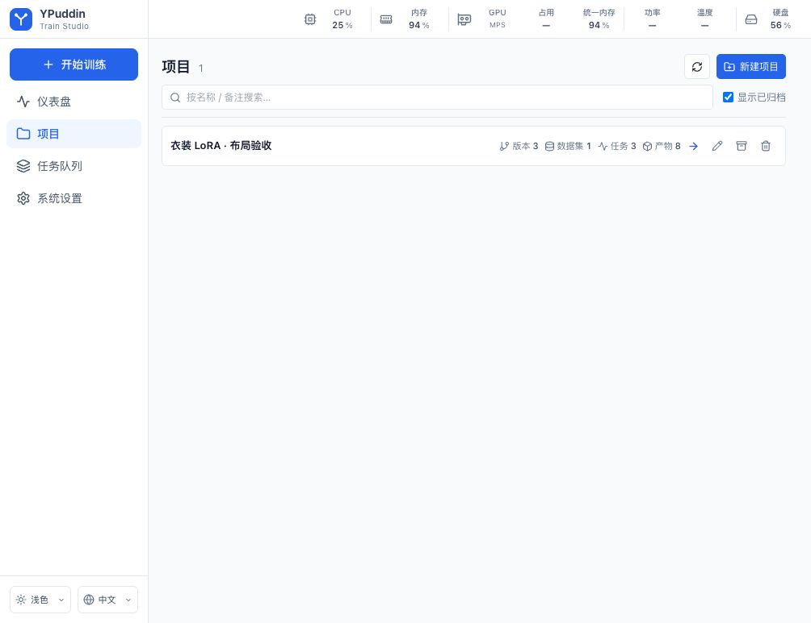
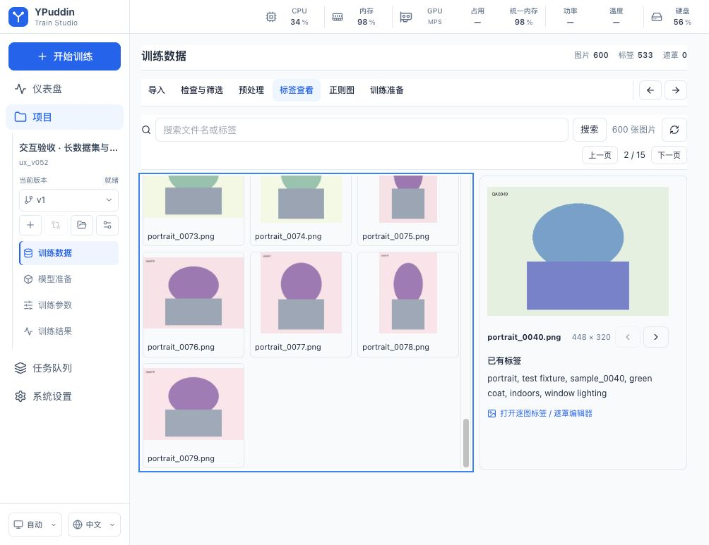
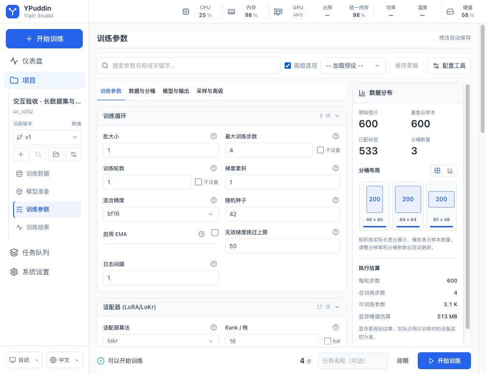

# v0.5.3 工作区布局复查与整改

本轮以用户逐次反馈重新审查，不将 v0.5.2 的单元测试通过等同于布局已经满足要求。全部历史要求及目录、训练、环境和下载链路的源码核对见 [15 项需求审计](USER_REQUIREMENTS_AUDIT_2026-09-12.md)。本轮重点修复实际页面暴露的导航重复、控件样式覆盖和无效留白。

## 对参考项目实际采用的原则

隔离运行本地 AnimaLoraStudio 0.27.0（参考 HEAD `3d9d2e86045b879cd19c01ac4aa2337f45a283ab`），实际查看项目列表和训练集筛选页面，并核对 Sidebar、Topbar、ProjectContext、StepShell 源码。参考的有效原则是：项目/版本/阶段放在侧栏；当前任务的标题与工具集中；图片面板独立滚动；空备注不单占一行。没有复制参考项目的实现或资源，也不以本轮 UI 验证推断训练质量、速度或显存优于参考。

本项目沿用真实版本隔离与独立任务目录，保留用户要求的四个主要工作阶段；数据处理子步骤只占正文一行。无需自动打标，因此不搬入参考项目的打标阶段。

## 已落地改动

- 项目列表改为紧凑行：名称、可选备注、版本/数据/任务/产物数量、进入与管理操作集中。只有实际多页才出现项目分页，不再显示空备注、创建日期和重复进入按钮。
- 项目名、ASCII ID、当前版本、版本搜索与管理、训练数据/模型准备/训练参数/训练结果移入侧栏。正文保留当前页面标题和必要状态。离开项目后侧栏上下文清理，打开设置抽屉时保留背景上下文。
- 数据导入改为全宽紧凑表单；上传/目录选择、文件选择、名称/重复次数/正则选项和提交可在首屏使用。DOM 和视觉顺序一致。流水线步骤及前后操作同行且固定可达，窄屏切换步骤时横向显示当前项，不滚动整个页面。
- 修复数据流水线通用 CSS 覆盖蓝色上传按钮、嵌套路径窗口和隐藏文件输入的问题；收窄正则表单规则。暗色选中步骤使用暗色底色，正常/禁用按钮与自定义下拉分别验证。
- 模型准备去掉重复标题。队列筛选在桌面同行排列，版本结果内嵌权重工具栏减少重复标题及整行空白。全局队列继续负责调度，项目结果继续按版本/任务查询采样与权重。
- 逐图标签/遮罩编辑也使用项目侧栏。标签保存失败有明确反馈并保留编辑状态；切换版本前处理未保存标签，打开遮罩编辑器时阻止外部导航悄悄丢弃绘制。移动侧栏层级高于正文固定导航，选择器与弹窗层级分别保留。
- 正式路由改用 Data Router 导航阻止机制，覆盖浏览器后退/前进、链接和程序导航。保存失败保留标签草稿；打开的遮罩保留画布与撤销记录；设置抽屉继续保留背景数据页。搜索下拉关闭后键入会重置筛选，不会提交不可见的旧选项。
- 修正失败任务在未知阶段仍显示“进行中”的误导状态。

## 浏览器验收范围

验收覆盖 1004×773、390×844 两个视口及深浅主题；主要页面包括项目列表、数据导入、路径选择器、标签查看、正则导入、高级训练参数、模型准备、模型下载与集中密钥、运行环境、版本结果和全局队列。每次发现问题回到源码修改后再实看，包括移动侧栏被 sticky 标题盖住、暗色步骤回落浅色背景、嵌套目录按钮被居中等。

单项目桌面行实测 48 px；1004 视口项目正文中的标题 36 px、数据步骤导航 39 px，操作正文从 y=163 开始。390 视口页面横向宽度等于视口，数据步骤自身横向滚动，所选步骤能通过前后按钮自动进入可视范围。数值取自浏览器 DOM 几何，不是设计稿推算。

正式构建后的长数据和多页任务验证、测试数量及截图列表记录在 [机器验收记录](validation/v0.5.3.json)。隔离夹具为 600 张生成图、251 条任务记录、48 张采样和 1400 行中文日志；夹具权重与采样只用于验证 UI，不是正式模型训练成果。原 8876 预览的数据、凭据和旧版项目目录保留。

最终前端验证为 48 个测试文件、282 项通过，TypeScript/ESLint/生产构建通过。正式 8894 页面中将隔离夹具的一个已有标签文件临时设为只读：编辑标签后点击浏览器后退，真实 PermissionError 发生时仍停留原页且草稿存在；恢复权限后重试，写入成功才离开。夹具标签和权限已恢复。真实遮罩编辑器清空后尝试后退，仍保留 0% 参与状态和可用撤销；撤销恢复 100% 后正常关闭，未写入遮罩。前进方向及设置背景 DOM 保留另由实际 AppRoutes 的 createMemoryRouter 回归覆盖。

8876 已按原启动参数重启为 0.5.3，项目/版本/数据源/任务/产物/模型六表内容哈希和凭据配置状态保持不变；正式构建的 39 个静态资源与本地文件逐一匹配。

## 交付边界

本轮修改前端与版本元数据，没有新增模型、CUDA 内核或依赖安装行为；后端既有 562 通过/3 CUDA 跳过是 v0.5.2 历史记录，不记作本轮重跑结果。没有执行 npm audit。

源码、前端构建及本机页面可核验，并不等于 Windows NVIDIA 已完成生产验收。完整 Anima/Krea 权重的 NVIDIA 训练、新机器依赖安装、真实账号的大模型下载/正则网站收集仍没有对应实机证据；这些边界不会以界面截图或模拟响应代替。
