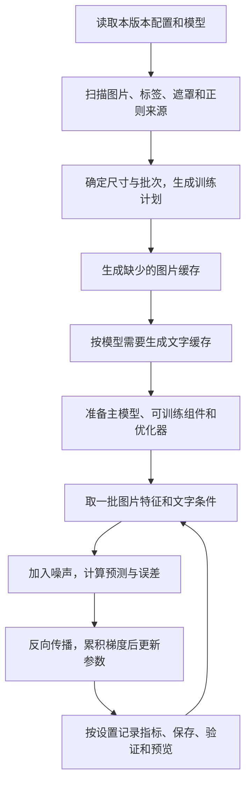

# 训练说明

本文说明点击“开始训练”后程序实际做了什么，以及分桶、缓存、显存、标签和保存相关的设置会带来什么影响。每个参数的简短说明和详细解释也可以在界面中查看（参数下方的提示和旁边的“?”）。

## 训练流程

训练会自动准备缺少的缓存，缓存方式在训练参数的“数据读取与缓存”中设置。已有有效缓存会直接复用。关闭图片缓存时，每取一批图片都要用 VAE 现场编码。

图片不会在磁盘上被改成训练尺寸，缩放、裁切和补边发生在读取和缓存阶段，原图保留不变。

## 选择训练方式

| 训练方式 | 更新和保存的内容 | 适合 |
| --- | --- | --- |
| LoRA／LoKr／LoHa 适配器 | 冻结底模，只更新附加的小型参数，保存适配器文件 | 角色、画风等可叠加的效果 |
| 全量微调：主模型 | 直接更新整个 UNet／DiT | 微调底模本身 |
| 全量微调：文本编码器 | 冻结主模型，更新文本编码器；SDXL 包括两个编码器 | 改变文字条件的编码 |
| 全量微调：两者 | 同时更新主模型与文本编码器 | 需要一起微调的任务 |

在“训练对象”中选择主模型、文本编码器或两者；可选项以当前模型与训练方式为准。选择全量微调后，适配器专属参数隐藏。

训练文本编码器时，标签必须每步重新编码才能反向传播：界面会改为每步编码，并锁定文字缓存和编码器卸载选项。VAE 仍然冻结，图片缓存照常可用。全量微调的可训练权重保持 FP32，计算时可以使用混合精度，不能使用 FP8 或分块换出。全量微调通常需要多得多的显存，不能用 LoRA 的占用去推算。

## 训练目标

| 模型 | 学习的目标 | 影响 |
| --- | --- | --- |
| Anima、Krea 2、Klein | Rectified Flow：把图片特征和噪声混合，预测两者之间的变化方向 | 可以使用时间步采样和 shift；Krea 2、Klein 默认按图像 token 数调整 shift |
| SDXL | DDPM：按噪声日程加噪，预测噪声 ε 或 v | 预测方式必须与底模一致；不能套用 Flow 的 shift 和加权 |

SDXL 支持 ε／v 预测和末端零信噪比；尚未提供完整的 Min-SNR、debiased 等加权组合，不支持的组合会明确拒绝。

## 步数、轮次和重复次数

- **一轮**：按当前数据计划走完一遍所有训练项。
- **重复次数**：让某个来源在一轮里多出现几次，不会复制磁盘上的图片。
- **批大小**：一次计算包含多少张图。
- **梯度累积**：经过几批才更新一次参数。界面上的训练步数按参数更新次数计算，不按图片数计算。

分辨率输入框可填写 `1024, 1536`，也可以用空格分隔，不写 `1024×1024`。参数页的分桶布局按基准分辨率分组显示。

例如 20 张图、两个基准分辨率、重复 3 次，分桶模式展开为 120 个训练项，这不是 120 次更新；批大小、梯度累积、桶的尾批和验证集划分都会改变最终步数。原生尺寸模式不按分辨率列表复制图片，只保留重复次数。

## 分桶

分桶决定“哪些图片用相同的宽高一起计算”，它本身不保证不裁图。完整过程分三步：生成可用的宽高 → 给每张图分配一个宽高 → 把原图放进这个尺寸。裁切、补边和缩放发生在第三步。

### 生成和分配

- 基准分辨率 **1024** 表示目标面积约 1024²，不是统一的正方形。默认候选桶的面积在基准 ±10% 内，长短边之比不超过 2，宽高按 64 像素步长生成。模型的对齐要求是 Anima／Krea 2／Klein 为 16，SDXL 为 8，64 同时满足。
- 程序完整枚举所有符合面积、宽高比和步长的尺寸，横图和竖图的候选对称。极端设置下没有合法尺寸时，退回最接近的对齐方形。
- 给图片选桶时，先按实际读图的方式模拟变换：裁切模式选丢弃画面最少的桶，完整画面模式选补边最少的桶；相同时优先少缩放，再比较与基准面积的差距。
- 候选桶由配置生成，不会根据数据集自动聚类。超出宽高比上限的狭长图会进入最接近的边缘桶，不会被跳过。

### 一张图最终保留多少画面

原图 **1500×1000**、基准 1024 时会选到 **1280×832** 的桶：

| 图像适配方式 | 实际处理 | 画面 |
| --- | --- | --- |
| 完整画面（`pad`） | 等比缩成 1248×832，左右各补 16 像素 | 构图完整保留，缩小会损失一些细节 |
| 裁切（`crop`） | 等比缩成 1280×853，上裁 10、下裁 11 像素 | 上下少了一部分 |

补边复制最邻近的边缘颜色，不会拉伸图片。程序同时生成“真实图片区域”的权重：纯补边位置不计入训练误差，边界按覆盖比例计算，即使没有开启遮罩也生效。

补边仍会经过 VAE，也仍是模型能看到的上下文，会占用算力和显存。“不计误差”不等于“完全没有影响”。完整画面模式首先是为了保留原始构图。

### 原生尺寸和“不放大小图”

原生尺寸模式不套用公共的桶，而是按每张图自己的尺寸安排训练，见 [原生尺寸训练](native-resolution.md)。

分桶模式的“不放大小图”会先把每个候选桶缩小并对齐到不超过原图，再按实际裁切或补边挑选，和原生尺寸模式是不同的算法。短边小于模型对齐尺寸时，“不放大”和“裁切填满”不能同时满足，需要使用完整画面模式。关闭“不放大小图”时，普通分桶仍可能放大小图，完整画面模式也一样。

### 尾批和兼容

- 单卡训练会保留凑不满一批的尾批，不复制图片去补齐；最后一批参与更新的图片可能更少。桶越多，构图越贴近，但批次利用率和缓存大小可能变差。
- 新建的网页配置默认 `image_fit = "pad"`；缺少这个字段的旧 JSON／TOML 仍按 `crop` 读取，已有配置不会被强制迁移。手写配置想保留完整画面，需要明确写 `pad`。
- 换了几何方式（裁切／补边／原生）后，不能继续原来的精确断点训练，可以新建版本或从已有权重开始。
- 分桶策略更新可能改变图片归组和顺序，所以分桶模式的训练状态带有策略版本，旧状态不能精确续训；实际几何相同的图片缓存仍可复用。

## 缓存与编码器卸载

| 名称 | 做什么 | 代价与用途 |
| --- | --- | --- |
| 图片缓存 | 提前把训练图片编码成模型使用的特征，写到磁盘 | 首次需要编码并占用磁盘，之后训练跳过重复的 VAE 编码 |
| 文字缓存 | 提前把标签编码成文字特征，写到磁盘 | 编完可以释放文本编码器；随机标签只能从预先生成的有限变体中选 |
| 每步编码 | 训练时把当前标签交给文本编码器 | 标签可以每步变化，但编码器要常驻或来回搬运 |

“每步编码”（旧称“在线编码”）完全在本机进行，不会把图片或标签传到网上。文字缓存模式下，随机标签默认为每张图预先生成 8 个变体，去重后可能更少。

开启图片缓存时，各模型的准备顺序：

| 模型 | 默认文字方式 | 准备顺序 |
| --- | --- | --- |
| Anima | 每步编码 | 主模型在 CPU 加载 → 图片缓存后卸载 VAE → 准备训练；选择文字缓存时先编码并卸载 Qwen |
| Krea 2 | 文字缓存 | 建立空的主模型结构 → 图片缓存后卸载 VAE → 文字缓存后卸载编码器 → 再加载 DiT 权重 |
| Klein | 文字缓存 | 同 Krea 2 |
| SDXL | 双 CLIP 文字缓存 | UNet 在 CPU 加载 → 图片缓存后卸载 VAE → 文字缓存后卸载双 CLIP → 准备训练 |

Anima 每步编码时，默认不会在每次编码后把编码器搬回 CPU；打开这个选项能省下编码器常驻的显存，但会增加搬运时间和电脑内存。Krea 2 的详细过程见 [Krea 2](krea2.md#加载顺序)。

缓存的有效性：

- 图片缓存按图片内容、实际尺寸、翻转方式和 VAE 身份区分；文字缓存按最终文本和编码器、分词器的文件身份区分。裁切和完整画面的缓存互相隔离。
- 遮罩不写进图片缓存：修改遮罩不需要重新编码同一张图，但精确续训仍会检查标签和遮罩的变化。
- 缓存先写临时文件再替换，同时读取不会拿到写了一半的文件。
- 缓存按内容共享，重复次数不会产生图片副本。

## 显存和内存

| 方法 | 减少什么 | 代价 |
| --- | --- | --- |
| 缓存后卸载编码器 | 训练时不再常驻 VAE 和文本编码器 | 首次编码时间、磁盘空间；预览时要重新加载 VAE |
| FP8 冻结底模 | 底模权重的存储 | 适配器、梯度、优化器、激活和反量化临时空间不受影响 |
| 分块换出 | 让部分冻结的主模型权重暂存在电脑内存，需要时再送到显卡 | 电脑内存和传输时间；适配器和梯度仍在显卡 |
| 梯度检查点 | 少保存前向中间结果，反向时重新计算 | 额外的计算时间 |
| 降低分辨率或批大小 | 图片特征、注意力等中间结果 | 不会同比例减少底模权重和加载峰值 |

训练计划中的显存数字是估算，用于配置和队列判断；任务运行时显示的是实际分配峰值。两者不能互相替代，一次低分辨率的峰值也不能代表所有配置。

### 底模存储精度

底模存储精度在高级参数中，默认“不转换（沿用加载精度）”。降低精度会带来舍入或量化误差，可能影响训练质量；显存足够时不需要为了省显存而转换。BF16 和 FP16 都是 16 位，互换不省空间；转回 FP32 也恢复不了已经丢失的精度。

选择 FP8 时，程序只对适配器覆盖的冻结线性层在启动时计算缩放并量化，原模型文件不改动。它只压缩权重存储，前向时仍把权重还原到计算精度再做普通的矩阵乘法，不是原生 FP8 计算，也不保证加速。

启动时量化与发布方提供的量化文件不是一回事。Krea 2 可以直接加载 Comfy-Org 的 `fp8_scaled` 文件，保留文件中的 FP8 权重和每个张量的缩放值；不支持分通道、分块、MXFP8 或 NVFP4 等其他格式。Anima 不能直接加载现成的 FP8 文件。

### 梯度检查点与梯度累积

梯度检查点在反向传播时重算模型块，用计算时间换显存，不改变有效批量，也不是训练存档。梯度累积连续处理多个小批次并累加梯度，达到次数后才更新参数，可以在显存放不下大批次时增大有效批量。完整批次下，有效批量为 `每卡批大小 × 累积次数 × 数据并行卡数`。

两者可以同时使用。多卡时的限制见 [多卡训练](multi-gpu.md)。

### 分块换出

分块换出选择最后 N 个模型块的冻结参数，前向、重算和反向时按需搬运，CUDA 上使用专门的传输流并提前预取。每个块按精度打包成一块主机内存，避免大量零碎的锁页内存分配。它不会搬走优化器和可训练的适配器参数。

当前限制：多卡训练和全量微调不能使用分块换出；SDXL 单卡也不提供；编译和分块换出不能同时开启。

### 精度要分开看

底模存储、前向计算、适配器参数和导出文件是不同的设置。适配器参数默认 FP32；把导出精度改成 BF16 不会减少训练中的占用。

## 数据管理

数据目录管理页可以修改目录名称和重复次数。当前版本的“训练集筛选”是独立页面，同屏查看参与训练与暂不训练的图片。选择图片后“暂时移出训练”只改变参与状态，不删除原图、TXT／JSON 标签或遮罩；需要时再加入。尺寸相关参数在训练参数页设置，数据分布用于查看计算结果。

透明检查以是否存在 Alpha 小于 255 的像素判断实际透明。全不透明的 RGBA 虽然带 Alpha 通道，但读取为 RGB 后画面不变，不需要只为 LoRA 训练专门转换。

## 标签、遮罩与正则

### 标签

- 支持同名 TXT 和结构化 JSON，见 [JSON 标签](json-captions.md)。自动格式优先 JSON；JSON 损坏时报错，不会悄悄改读 TXT。
- 打标时已经写进标签的触发词会直接读取，不需要再填一次。
- 重复次数从数据来源的设置或配置中的 `repeats` 读取，默认 1。**不会把目录名开头的数字当成重复次数**，从其他训练器迁移数据时，请在来源设置中登记重复次数。

### 遮罩

白色部分参与训练误差，黑色部分不计误差，灰色按比例加权；图片本身仍完整输入模型。遮罩与图片使用相同的缩放、裁切和翻转，再与补边的有效区域相乘。它告诉训练“重点算哪里”，不是抠掉背景，也不能保证模型完全学不到背景。

每张图先在自己的有效区域内求平均误差，再按样本权重合并。所以遮罩只剩四分之一面积时，这张图的误差不会因为面积小就被压成四分之一。

### 正则图

正则图用来保持底模对一般类别的表现，通常与训练图混合使用。本版本 `reg/` 目录下的图片会自动识别为正则来源，外部来源仍需明确设置。

程序不会自动把训练图和正则图配成一比一：出现比例由两边的图片数、重复次数和分辨率展开决定，`prior_weight` 再乘到正则图的误差上。例如正则图原误差 0.8、权重 0.25，加权后贡献 0.2。权重为 0 时仍占批次位置，不等于从数据集删除。

## LoKr 的 full 和相关名称

**LoKr 的 `rank = full` 指两个 Kronecker 因子使用完整矩阵，不是训练整个底模。** 它仍用较小的因子表示权重增量。例如 3072×3072 的线性层，平衡分解后两个因子为 48×48 和 64×64，共 6,400 个参数；完整矩阵有 9,437,184 个参数。

| 名称 | 含义 |
| --- | --- |
| `algo = "lokr"`, `rank = "full"` | LoKr 因子不再做低秩拆分 |
| `algo = "full"` | 对适配器作用范围内的线性层训练完整的权重差分 |
| `training.mode = "full"` | 全量微调，直接更新勾选的主模型或文本编码器 |
| `preset = "full-linear"` | 扩大适配器作用的线性层范围，不改变算法 |

两个因子都是完整矩阵时，缩放固定为 1，alpha 不再生效。普通 LoKr 前向通过分解后的矩阵乘法计算增量，不构造完整的 ΔW；DoRA 和合并权重时才需要重建。

## 采样与预览

三种“调度器”不要混淆：

| 设置 | 影响什么 |
| --- | --- |
| 时间步采样 | 训练时每张图加多少噪声，模型练习哪些噪声阶段 |
| 学习率调度器 | 每次参数更新的幅度如何随训练进度变化 |
| 预览采样器和采样调度器 | 出图时用什么求解方法、经过哪些时间点 |

Euler、Heun、ER-SDE 是不同的求解方法，不是画质等级。Heun 每步多一次校正，计算量更大；步数更多或阶数更高不一定更好。Flow 模型提供 Euler／Heun／ER-SDE 和四种时间网格，SDXL 目前只有 Euler／Heun 和均匀网格。

训练预览需要时会重新加载 VAE 和文本组件，所以预览时的占用可能比纯训练阶段高。预览使用独立的随机状态，结束后恢复训练的随机状态。

比较不同权重、LoRA 强度和采样参数，使用 [模型测试](xyz-sampling.md)。

## 权重、完整状态和指标

- **推理权重**用于出图或作为新训练的起点；**完整训练状态**还保存优化器、随机数和数据位置，用于精确续训。修改数据、编码器或几何方式后，精确续训可能被拒绝。
- 文件默认按项目名和版本命名，输出按项目、版本和任务分开，两次训练不会互相覆盖。
- 全量微调保存为 `.model` 目录，包含训练组件的原生权重、配置和清单；未参与训练的 VAE、分词器继续引用原模型。重新开始训练时可以选择这个目录中的组件；要接着原进度训练，请恢复完整训练状态。
- 界面上的“当前 Loss”是最近一次更新的损失；“平均 Loss”是所有成功更新的平均值；图表中的平滑曲线只用于观察趋势；“验证 Loss”是在保留数据上的另一次评估。这些指标不能互相替代，也不能拿不同模型或不同噪声设置的 loss 大小比较画质。
